# Spec2.02 功能说明与截图文档

- 编制日期：2026-08-04
- 入口：`../Spec2.02/SpecDirect.exe`
- 源码：`../Spec Source/Source`
- 运行环境：2880×1800，桌面缩放 200%
- 正式截图：49 张 PNG，全部 2880×1800

## 使用说明

本文档按功能树层级组织：先给出源码审查最终版功能树，再按 0-6 功能组列出运行截图。截图名称按功能重命名，未被最终文档引用的过程/补充截图已清理，备份副本保留。

## 功能树（源码审查最终版）

# Spec2.02 功能树（源码审查最终版）

## 1. 研究范围

- 软件入口：`../Spec2.02/SpecDirect.exe`
- 版本：SpecDirect 2.0.2.5（程序文件版本信息）
- 源码依据：`../Spec Source/Source/Main`、`../Spec Source/Source/Common`，以及工程内的 Pascal、DFM、README 和运行数据文件。
- 说明：本文件作为功能树最终版，按源码、窗体定义和已有运行证据整理。

## 2. 顶层功能树

### 0. 工作台与运行基础

#### 0.1 程序启动与运行环境

- 主程序入口和单实例运行：`SpecDirect.dpr`、`UniqueInstanceUnit.pas`
- 主窗口、工具栏和六组主菜单：`FmMain.pas/.dfm`
- 启动读取 `DIRECT.CFG`、`DIRECT.OPT`，应用打印机参数
- 初始化方法库、样品/结果矩阵、串口通信对象、CCD 采集线程和分析线程
- 维护当前方法标题、动作启用状态和工作文件类型（`.cdt/.cmt/.edt/.wdt/.pdt/.dat`）

#### 0.2 消息与状态反馈

- 底部“信息记录”停靠面板
- 常规信息、分析信息和异常提示的记录/清空/保存/复制/全选
- 采集、分析、导出和数据库操作的完成状态及错误反馈

### 1. 光谱方法（主菜单：光谱方法）

#### 1.1 方法文件生命周期

- 新建方法：输入方法名、名称合法性检查、重名检查、创建方法记录
- 打开方法：从方法库选择并载入方法主信息、CCD 布局、激发条件和分析谱线
- 另存为：保存当前方法副本
- 退出软件

#### 1.2 打印机与页面

- 页面设置：纸张、方向、边距和打印布局
- 打印机设置：系统打印机选择及打印参数

#### 1.3 方法文件和数据库对象

- 方法库：`DIRECT.MTD`
- 方法配置对象：`TSdMtd`
- 方法-谱线映射：`TSdMtdMap`
- 样品/谱带数据：`.cdt` 均值样品、`.cmt` 全时样品、`.edt` 蒸发数据、`.wdt` 色散数据
- 分析结果：`.pdt` 强度结果、`.dat` 分析报告

### 2. 分析条件（主菜单：分析条件）

#### 2.1 方法参数

- 方法基本信息和启用状态
- CCD 安装布局、CCD 选择和色散曲线参数
- 参考波长、实际参考波长、参考线宽度
- 激发/预激发/空白周期、重复次数、曝光区间
- 标准样品、校准和异常阈值等分析条件

#### 2.2 分析谱线

- 谱线列表和当前谱线选择
- 新建谱线：元素符号与谱线波长选择
- 谱线编辑/删除
- 谱线类别（源码明确）：分析线、内标线、定位线；背景/基线在源码中作为背景计算或分析参数处理，未发现独立的“基线谱线”类型
- 分析线内标方式：无内标、背景内标、普通内标线
- 峰值、背景、定位、拟合方式、单位、浓度/含量和超差参数
- 谱线顺序、启用状态和方法映射关系

#### 2.3 参数打印

- 打印当前方法参数
- 打印分析谱线配置

### 3. 分析测试（主菜单：分析测试）

#### 3.1 摄谱/数据采集

- 色散摄谱（`.wdt`）：建立色散数据文件、设置激发条件、采集 CCD 周期
- 蒸发摄谱（`.edt`）：设置蒸发/激发条件、保存全帧数据
- 样品摄谱（`.cdt` 或 `.cmt`）：输入样品名、创建样品文件、按方法布局采集
- CCD 采集线程：发送串口命令、接收 CCD 帧、生成谱带、保存数据
- 激发向导：样品队列、当前样品、激发计时、进度、暂停/继续/停止、完成收尾
- 采集状态：CCD 曲线、曝光区间、谱带/周期数据和采集消息

#### 3.2 谱图查看与交互

- 查看谱图：载入一个或多个谱带并绘制 CCD 强度曲线
- 单样品/多样品视图
- 上/下一个谱带、上/下一个 CCD
- 参考线校正、分析谱线定位、增加/删除谱线
- 选择区域放大、适合图像、100%/400% 视图、横向/纵向缩放和还原
- 十字线、滚动工具、优先显示和谱线锁定
- 加载/保存全部谱线位置、移动到短波/长波、还原实际位置
- 打印 CCD 谱图和谱带细节

#### 3.3 数据分析

- 色散曲线分析（`.wdt`）
- 蒸发曲线分析（`.edt`）
- 单样品分析（`.cdt/.cmt`）
- 多样品分析和批量样品浏览
- 预录样号：录入、插入、删除、全部清除、打开/保存样品号文件、纵向预览
- 样品查看面板和样品队列管理
- 分析线程：参考线定位、谱线扫描、寻峰、背景计算、结果矩阵写入

#### 3.4 标准曲线与结果复核

- 标准样品重复测量质控：接受/剔除重复值、均值、标准差、RSD 和有效次数
- 工作曲线：直线、二次、三次、样条拟合及对数坐标
- 标准点激活/停用、原始值恢复、全部原始值恢复、手工调整后重算
- 曲线图、标准点表、样品结果表切换
- 单谱线切换、下一条谱线、结果合并和保存
- 标准曲线图像/文本打印
- 既有结果重算入口（配合“数据处理”）

#### 3.5 全时数据处理

- 从全时样品中选择曝光区间
- 观察全时谱带并按区间导出数据
- Excel 观察器/输出对象：`TXlsCmtBandObs`

### 4. 数据处理（主菜单：数据处理）

#### 4.1 重新计算

- 打开既有 `.pdt`
- 载入分析矩阵、按当前方法重新拟合/计算含量
- 显示工作曲线并重算分析结果
- 时间/方法一致性检查和异常提示

#### 4.2 打印报告

- 选择 `.dat` 报告文件
- 设置报告编号、打印报告、保存报告
- 使用文本/GDI 打印对象输出结果

#### 4.3 导出报告（`.dat`）

- 三步向导：选择文件、选择输出格式/排列、确认导出
- 文本或 Excel 输出
- 常规排列/交换排列
- 批量选择、全选/反选、输出目录和文件名

#### 4.4 导出强度（`.pdt`）

- 三步向导：选择强度文件、设置导出选项、确认导出
- 导出原始/处理后强度矩阵
- 文本或 Excel 输出

### 5. 工具（主菜单：工具）

#### 5.1 软件参数

- 数据目录、方法/样品默认目录
- 日志记录、消息面板和运行记录
- 显示、打印和时间模式相关选项
- 配置读写：`DIRECT.OPT`

#### 5.2 设备参数

- 串口号、波特率及连接测试
- 屏幕分辨率/屏幕宽度换算
- CCD 设置、保护时间和设备相关参数
- 配置读写：`DIRECT.CFG`

#### 5.3 调试对中

- CCD 实时曲线和曲线选择
- 十字线、滚动、适合图像、100%/400% 视图
- X/Y 缩放、CCD 切换和状态提示
- 串口/CCD 诊断和调试信息

#### 5.4 方法管理

- 方法库浏览、方法选择和方法记录维护
- 方法启用/禁用和当前方法切换

#### 5.5 备份压缩数据库

- 方法库备份
- Access 数据库压缩
- 日志/临时数据清理
- 备份路径与操作结果提示

#### 5.6 导入蒸发摄谱文件

- 选择源 `.edt`
- 选择输出 `.cdt/.cmt`
- 记录列表浏览、选择/反选
- 设置取样区间和目标 CCD 布局
- 导入并写入谱带数据

### 6. 帮助（主菜单：帮助）

#### 6.1 帮助主题

- 打开程序同目录 `DIRECT.CHM`
- HTML Help 窗口、目录/索引/主题阅读

#### 6.2 关于

- 软件名称和版本信息
- 版权信息
- 关闭关于窗口

## 3. 源码窗体与功能节点映射

| 源码目录 | 关键窗体/单元 | 对应功能树 |
|---|---|---|
| `Main` | `FmMain`, `SpecDirect.dpr` | 0、1、2、3、4、5、6 的入口与调度 |
| `Main/mmMethod` | `FmInputQuery`, `FmSelect`, `FmMtdCfg`, `FmMtdLines`, `FmMtdLinesAdd`, `FmMtdPrint`, `FmPageSetup` | 1、2 |
| `Main/mmAnalyze` | `FmIgnitCon`, `FmDockGuideIgnit`, `FmDockGuideLines`, `FmView`, `FmViewSingle`, `FmViewMulti`, `FmViewDetail`, `FmSampInput`, `FmSampView`, `FmAnaCheck`, `FmAnaCurve`, `FmAnaPdt`, `FmPrintCcd`, `FmWstc`, `FmAnaProgress` | 3 |
| `Main/mmData` | `FmExport`, `FmPrintDat` | 4 |
| `Main/mmTool` | `FmCfgSoftWare`, `FmOptHardWare`, `FmDebug`, `FmMtdManage`, `FmMtdBackup`, `FmImportPre` | 5 |
| `Main/Others` | `FmMessage`, `FmAbout`, `FmHint` | 0、6 |
| `Common` | `uConfigs`, `uOptions`, `uDbPack`, `uMethod`, `uMethodMap`, `uCcdBand*`, `uCcdThread`, `uAnaLine`, `uAnaThread`, `uFitMode`, `uPeakMode`, `uExport`, `uPrinter`, `uSioLink` | 0、1、2、3、4、5 的业务支撑 |

## 4. 验证状态口径

- **源码确认支持**：源码和界面/流程足以确认已实现；若没有合格运行截图，仍需另加截图证据状态。
- **部分支持**：源码只覆盖要求的一部分，或缺少完整流程、配置项或闭环。
- **基本支持，需验收**：源码已有相关逻辑或入口，但必须通过完整运行流程确认产品行为。
- **源码确认但缺少合格运行截图**：源码/入口已确认，当前环境因硬件、数据、依赖或运行条件无法取得完整有效画面。
- **重点补充/重点明确验收**：源码未发现明确实现，或现有实现与要求存在明显差距，需要后续版本补充或形成验收条款。
- **未发现实现**：在源码和运行入口中均没有足够证据，不能用报错图或猜测代替。

### 4.1 功能树节点的运行证据状态

| 功能节点 | 源码依据与源码状态 | 当前截图证据状态 | 下一步 |
|---|---|---|---|
| 3.1 摄谱采集完整暂停/继续/停止/完成收尾 | `uCcdThread`、`FmDockGuideIgnit`；源码确认支持 | 源码确认但缺少合格运行截图；正式图只覆盖采集控制台和预激发进度 | 有真实 CCD/电弧时补完整运行闭环，保留有效数据和收尾状态 |
| 3.5 全时数据独立导出 | `FmMain` 全时观察器、`TXlsCmtBandObs`；源码确认支持 | 源码确认但缺少合格运行截图；已有图只证明全时谱图查看/观察 | 用实际 `.cmt` 补导出成功结果，确认文件写回 |
| 3.3/5.3 慢进与人工干预 | `FmViewSingle`、`G_SdCfgs.IsLookBand`、分析线程暂停/继续；基本支持，需验收 | 源码确认但缺少合格运行截图；当前仅有监控/等待时间配置图 | 补“逐谱线暂停→人工定位调整→继续→结果写回”闭环 |
| 5.3 调试对中有效 CCD 曲线 | `FmDebug`、`uCcdThread`；源码确认支持 | 源码确认但缺少合格运行截图；当前硬件条件只能取得串口异常 | 连接有效设备后补曲线、峰值/位置和调节结果图 |
| 6.1 帮助主题 | `FmHint` 调用同目录 `DIRECT.CHM`；源码确认支持 | 源码确认但缺少合格运行截图；当前目录缺少帮助文件 | 补齐 `DIRECT.CHM` 后补主题、目录/索引阅读图 |
| 4.2/4.3 报告打印预览、PDF 导出 | `FmPrintDat`、`FmExport` 仅明确直接打印、文本/Excel；部分支持 | PDF/独立预览无合格运行证据；文件选择器和错误图不纳入 | 后续版本补 PDF、独立预览和成功导出结果并验收 |
| 5.4 角色、用户、登录和权限 | 主程序、工具、数据库和公共单元未发现实现 | 未发现合格运行截图 | 后续版本补用户/角色/登录/权限/审计模块，形成验收条款 |

## 5. 新软件功能要求（独立章节）

> 本章单独保留用户提供的新软件要求，不并入现有软件功能树。下列“源码审查结论”仅表示在 `Spec Source\Source` 中检索到的实现证据，不将“未完成运行验证”误判为“没有功能”。

### 5.1 自动转角平面光栅电弧直读发射光谱仪分析软件

#### 5.1.1 分析方法

- **1.1.1 摄谱区间数据保存**：方法的各个转角对应的摄谱区间可自由选择保存区间平均值或全区间数据。
  - 源码审查结论：**部分支持/已发现实现线索**。`ExpSegMode`、方法级 `ExpSeg` 以及逐谱线 `TExpSeg` 支持区间曝光和区间数据；`TCcdBand` 同时存在平均值与分段/全时数据处理逻辑。当前功能树应按“按转角/曝光区间选择平均值或分段/全时数据”理解，源码未确认一个独立且明确命名为“全区间数据”的界面开关。
- **1.1.2 谱线可检测范围计算**：在方法中增加谱线时，应能计算谱线是否在可检测范围内。
  - 源码审查结论：**部分支持**。`CheckWaveValid`、`Wave2Point` 和 CCD 边界检查可判断波长是否落在 CCD 布局范围内；未发现独立的“可检测范围”配置及新增谱线时的完整提示流程。
- **1.1.3 谱线类型和内标方式**：谱线支持基线、分析线、内标线、定位线；分析线的内标可选内标线、背景做内标、无内标。
  - 源码审查结论：**部分支持**。源码明确存在分析线、内标线、定位线；分析线内标下拉项明确包含“无内标”“背景内标”和普通内标线，计算代码也分别处理背景内标与普通内标。未发现独立“基线谱线”类型，当前基线仍由背景参数和背景计算逻辑承担。
- **1.1.4 分析线峰值方式**：分析线的峰值可选最大值（单点）或高斯曲线（峰面积）。
  - 源码审查结论：**源码确认支持**。`uPeakMode.pas` 及分析线相关代码存在最大值和高斯峰值模式。
- **1.1.5 拟合坐标**：分析线拟合时可选对数坐标、普通坐标。
  - 源码审查结论：**源码确认支持**。`uFitMode.pas`、`FmAnaCurve` 存在对数坐标/普通坐标相关逻辑。
- **1.1.6 拟合函数**：分析线拟合函数有直线函数、二次曲线、三次曲线、样条函数插值等。
  - 源码审查结论：**源码确认支持**。源码和分析曲线窗口包含直线、二次、三次和样条拟合入口/逻辑。
- **1.1.7 方法参数打印**：分析方法的条件参数及谱线参数应可打印。
  - 源码审查结论：**源码确认支持**。`FmMtdPrint` 对应方法参数和分析谱线参数打印。

#### 5.1.2 分析测试

- **1.2.1 自动转角和摄谱状态判断**：通常先短波后长波以节省光栅转动时间，必要时可优先转至关键波段；摄谱时通过基线强度和位置判断电弧是否正常并提示异常，峰位异常时自动校正或提示。
  - 源码审查结论：**部分支持**。采集状态 `wsPre/wsBurn/wsTurn/wsDark`、转角控制消息、参考线偏移提示和峰位自动定位/校正逻辑已发现；未发现短波到长波排序、关键波段优先转角的明确配置，也未确认以基线强度和位置判定电弧健康并联动提示、重采或校正的完整异常闭环。
- **1.2.2 摄谱类型和曲线分析**：支持色散摄谱、蒸发摄谱、样品摄谱，以及后续色散曲线、蒸发曲线、样品分析。
  - 源码审查结论：**源码确认支持**。对应 `.wdt`、`.edt`、`.cdt/.cmt` 数据类型以及色散、蒸发、样品分析窗体和流程。
- **1.2.3 多样品谱图对比**：可查看谱图，并同时查看、对比多个样品的谱图强度。
  - 源码审查结论：**源码确认支持**。`FmViewSingle`、`FmViewMulti` 和谱带查看逻辑支持单样品/多样品视图。
- **1.2.4 谱线/检测器信号定位和缩放**：查看谱图和样品分析时，可定位各分析谱线或某转角某检测器的单点强度；谱图支持横向、纵向缩放。
  - 源码审查结论：**源码确认支持**。`FmView` 及单/多样品视图包含谱线定位、曝光区间/点位查看、横纵向缩放、十字线及还原功能。
- **1.2.5 样号输入时机**：样品分析前可输入样号，也可摄谱完成后再命名样品。
  - 源码审查结论：**源码确认支持**。`FmSampInput`、样品队列和样品查看流程支持预录样号与采集后样品信息维护。
- **1.2.6 慢进和人工干预**：样品分析支持慢进，可实时查看分析线峰位及周边谱图，必要时人工干预。
  - 源码审查结论：**源码确认基本支持，需补充慢进模式验收**。软件参数中的 `IsLookBand`/等待时间使分析线程可在每条谱线处理后暂停，界面支持查看谱线及周边谱图、继续分析和人工定位调整；仍需确认产品界面是否明确命名为“慢进”，以及人工调整结果是否稳定写入最终分析结果。
- **1.2.7 重复性误差识别和预警**：自动识别检测数据重复性误差并自动预警。
  - 源码审查结论：**源码确认支持**。`FmAnaCheck` 计算均值、标准差、RSD 和超差状态，并有异常提示/人工剔除流程。
- **1.2.8 标准曲线切换和调整**：拟合标准曲线时可随机切换拟合方式，根据管理样数值调整曲线并保存调整后的标准强度。
  - 源码审查结论：**源码确认支持**。`FmAnaCurve` 支持拟合方式切换、标准点启用/停用、原始值恢复、手工调整和重算。
- **1.2.9 调试和汞灯调试**：可不摄谱而激发电弧，并用汞灯调试光学系统。
  - 源码审查结论：**部分支持**。`FmDebug` 已支持不保存正常样品谱的连续调试采集、CCD 曲线查看、峰值/位置观察和对中调节；未发现汞灯选择、汞灯谱线校准或汞灯专用调试流程。

#### 5.1.3 分析报告管理

- **1.3.1 报告打印、预览和导出**：支持灵活打印不同类型报告；打印预览可导出 Excel、PDF 等格式。
  - 源码审查结论：**部分支持**。源码支持报告打印、文本导出和 Excel 导出；未发现 PDF 导出和独立打印预览功能的明确实现。

#### 5.1.4 角色管理

- **1.4.1 角色和权限**：不同级别人员具有相应权限。
  - 源码审查结论：**未发现实现**。已检查主程序、工具、数据库和公共单元，未发现角色、用户、登录、密码或权限控制模块；数据库源码中的用户表相关内容为注释/历史字段线索，不能作为已实现角色管理的证据。

### 5.2 新软件要求的状态分解

下表把“源码状态”“截图证据状态”和“下一步”分开记录。截图缺失只表示当前没有合格运行证据，不表示源码没有对应逻辑。

| 要求项 | 源码状态 | 截图证据状态 | 下一步 |
|---|---|---|---|
| 摄谱区间数据保存 | 部分支持 | 源码确认但缺少合格运行截图 | 补按转角切换平均值/全时数据的有效配置或结果图 |
| 新增谱线可检测范围 | 部分支持 | 源码确认但缺少合格运行截图 | 补输入越界波长后的提示图并验收 CCD 边界提示 |
| 谱线类型与内标方式 | 部分支持 | 已有合格运行截图 | 验收基线是否需要独立谱线类型 |
| 峰值方式、拟合坐标、拟合函数 | 源码确认支持 | 已有合格运行截图 | 按现有最大值/高斯、普通/对数坐标及四类拟合进入产品验收 |
| 方法参数打印 | 源码确认支持 | 已有合格运行截图 | 补打印输出文件或纸面结果时做质量验收 |
| 转角排序与电弧/峰位异常闭环 | 部分支持 | 源码确认但缺少合格运行截图 | 有真实设备时补排序、关键波段优先、异常提示/校正/重采/写回闭环 |
| 摄谱类型、曲线分析、多样品谱图、定位缩放 | 源码确认支持 | 已有合格运行截图 | 按现有色散/蒸发/样品和谱图交互进入产品验收 |
| 样号输入时机 | 源码确认支持 | 已有合格运行截图 | 补采集完成后重命名的有效结果图，确认写回样品信息 |
| 慢进与人工干预 | 基本支持，需验收 | 源码确认但缺少合格运行截图 | 补逐谱线暂停→人工调整→继续→结果写回闭环 |
| 重复性误差识别、标准曲线切换与调整 | 源码确认支持 | 已有合格运行截图 | 按 RSD、拟合切换、标准点停用/恢复和重算进入产品验收 |
| 调试与汞灯调试 | 部分支持；汞灯流程重点补充 | 源码确认但缺少合格运行截图 | 补有效 CCD 调试曲线；新版本增加汞灯选择、校准和专用流程 |
| 报告打印、预览与导出 | 部分支持 | 已有文本/Excel 配置截图；PDF/独立预览缺少合格证据 | 后续版本补 PDF 和独立打印预览，当前不宣称 PDF 成功 |
| 角色和权限 | 未发现实现 | 无合格运行截图 | 后续版本补用户、登录、角色、权限和审计并形成验收条款 |

### 5.3 新软件要求的补充结论

- 现有软件功能树已覆盖当前源码可确认的主要方法、采集、谱图、分析、数据处理、工具和帮助功能。
- 新要求中源码明确存在或基本覆盖、但仍需进行产品化验收的项目：背景内标/无内标选项、慢进模式、峰位自动定位/校正及人工干预结果写回。
- 新要求中需要在后续版本重点补充或明确验收的项目：独立基线谱线类型、转角短波到长波排序、关键波段优先策略、基线/峰位异常闭环、汞灯专用调试模式、PDF 导出、打印预览、角色和权限管理。
- 本章与前面的现有功能树分开记录：前文回答“当前 Spec2.02 源码有哪些功能”，本章回答“新软件要求有哪些，以及当前源码对这些要求的支持程度”。

## 截图与功能树对照复核

- 正式目录：49 张独立 PNG 功能证据；补充目录复核后仅纳入有效采集状态图。
- 非正式过程/补充截图：已清理出正式目录；未被最终文档引用的素材不再保留在当前截图文件夹，备份副本仍保留。
- SHA-256 完全重复检查：49 张正式 PNG 均为唯一文件。
- 缩略图视觉相似度复核：以余弦相似度 0.995 为人工复核阈值，发现 7 对候选；候选均为不同功能或不同业务状态，未自动删除。
- 正式目录不是所有尝试截图的总数；它只保留真实功能界面、实际数据界面或有明确业务价值的配置界面。
- 清理前未采用的素材主要是菜单、空白/无数据工作台、Windows 文件选择器、报错/警告、覆盖确认、任务管理器、Codex 界面、焦点探测或与正式图重复的版本；这些文件已从当前截图文件夹移除，备份副本保留。

### 当前已有合格运行截图的功能范围

- 光谱方法：新建、打开、另存为、页面设置和打印机设置。
- 分析条件：激发/谱板/谱带参数、分析谱线列表和编辑入口、谱线类别、内标方式、峰值方式、拟合方式及参数打印。
- 分析测试：色散/蒸发/样品摄谱工作条件、样品摄谱采集控制台、预激发进度、预录样号、实际谱图、多样品对比、横纵向缩放、十字线/单点强度、全时样品谱图、样品分析结果、标准曲线、重复性数据检查和慢进参数入口。
- 数据处理：重新计算、打印报告、报告导出向导三步、强度导出三步向导及实际文件载入；未纳入 PDF 保存对话框或文件选择器。
- 工具与帮助：软件参数、设备参数、CCD 设置、方法管理、备份压缩数据库、蒸发文件导入和关于窗口。

### 功能树中尚无合格运行截图的细分节点

- 真实硬件采集过程中的暂停/继续/停止和完成收尾闭环；现有正式图只覆盖采集控制台和预激发倒计时，不宣称硬件采集成功。
- 慢进的完整暂停→人工调整→继续→结果写回闭环；当前截图只证明测量谱带监控和等待时间配置入口。
- 全时数据独立导出完成状态；现有全时样品谱图只证明查看/观察，不证明独立导出成功。
- 报告打印预览、PDF 导出和成功导出后的结果页；已补齐报告导出向导第 1–3 步，但 PDF 保存对话框、文件选择器和错误残留图均不作为功能证据。
- 调试对中有效曲线/汞灯调试画面；当前硬件条件下只能出现串口异常，未纳入正式证据。帮助主题同理，现有候选为 DIRECT.CHM 缺失提示。
- 新软件要求中的转角排序/关键波段优先、基线/峰位异常闭环、汞灯专用流程、PDF/打印预览和角色权限管理，不能由现有截图宣称已实现；具体源码结论仍以功能树第五章为准。

### 复核结论

49 张正式截图已覆盖功能树中主要可见配置、实际数据和结果功能；仍不能覆盖每一个源码内部节点、硬件运行状态或每一个运行时分支。清理前已复核过程/补充目录，未把无关、报错或重复截图纳入正式证据；未采用素材已移除，备份副本保留。缺口已在功能说明中标为“源码确认但缺少合格运行截图”或“后续版本重点补充”。

## 截图证据

### 1. 光谱方法

覆盖方法的新建、打开、另存、页面设置、打印机设置以及方法库对象的基本生命周期。

源码依据：Main/mmMethod/FmInputQuery、FmSelect、FmPageSetup，以及 FmMain 方法菜单动作

#### 图 1：光谱方法 / 另存为 / 输入名称

- 文件：`10_光谱方法_另存为_输入名称.png`
- 实测状态：实测输入/命名界面
- 功能说明：展示当前方法副本命名入口，确认另存为功能可从当前方法生成新方法。
- 源码依据：Main/mmMethod/FmInputQuery、FmSelect、FmPageSetup，以及 FmMain 方法菜单动作

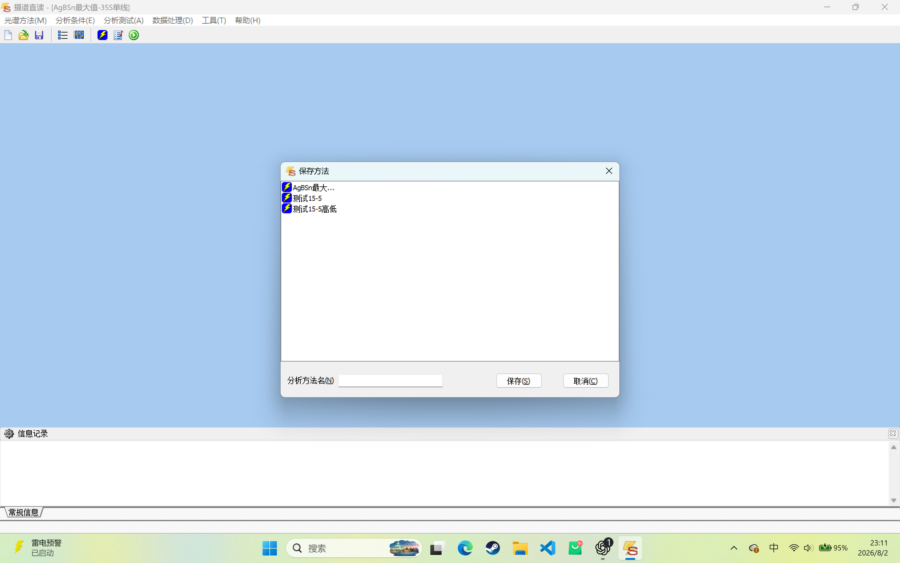

#### 图 2：光谱方法 / 打印机设置

- 文件：`10_光谱方法_打印机设置.png`
- 实测状态：实测界面
- 功能说明：展示系统打印机和打印参数设置入口。
- 源码依据：Main/mmMethod/FmInputQuery、FmSelect、FmPageSetup，以及 FmMain 方法菜单动作

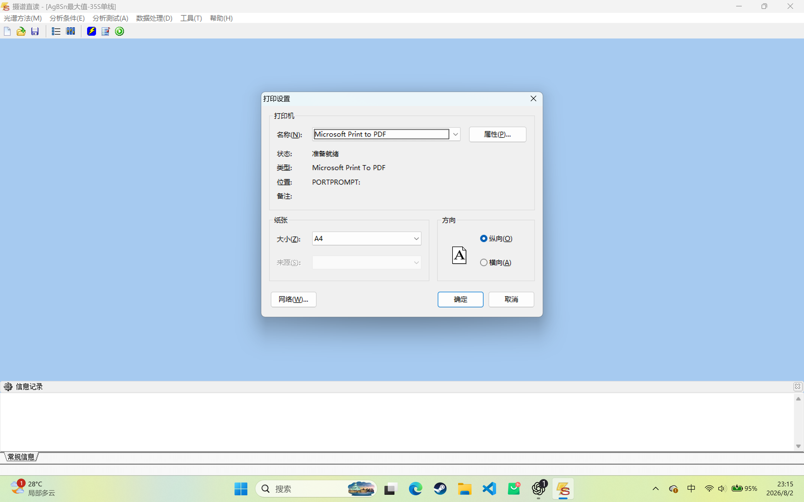

#### 图 3：光谱方法 / 打开方法 / 方法列表

- 文件：`10_光谱方法_打开方法_方法列表.png`
- 实测状态：实测方法库列表界面
- 功能说明：展示从方法库选择并载入方法的界面，确认方法列表和当前方法切换入口。
- 源码依据：Main/mmMethod/FmInputQuery、FmSelect、FmPageSetup，以及 FmMain 方法菜单动作

#### 图 4：光谱方法 / 新建方法 / 输入名称

- 文件：`10_光谱方法_新建方法_输入名称.png`
- 实测状态：实测输入/命名界面
- 功能说明：展示创建方法时的名称输入和校验入口，确认方法文件生命周期的起点。
- 源码依据：Main/mmMethod/FmInputQuery、FmSelect、FmPageSetup，以及 FmMain 方法菜单动作

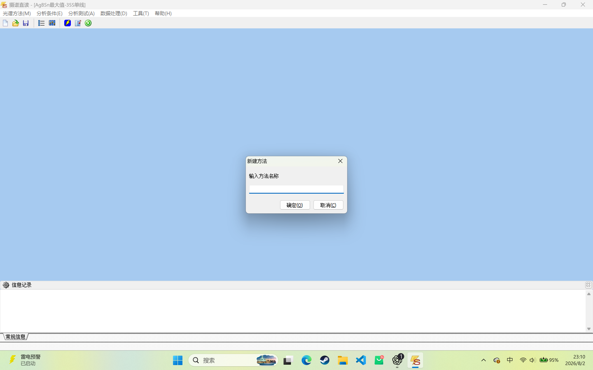

#### 图 5：光谱方法 / 页面设置

- 文件：`10_光谱方法_页面设置.png`
- 实测状态：实测界面
- 功能说明：展示纸张、方向、边距等页面参数入口，用于配置方法参数和报告打印布局。
- 源码依据：Main/mmMethod/FmInputQuery、FmSelect、FmPageSetup，以及 FmMain 方法菜单动作

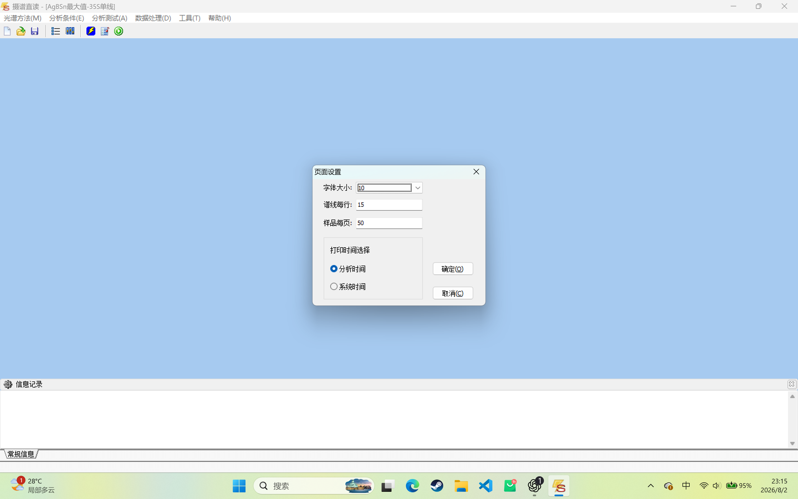

### 2. 分析条件

覆盖方法参数、谱板/谱带参数、分析谱线配置、峰值和拟合方式、内标方式、谱线类型及参数打印。

源码依据：Main/mmMethod/FmMtdCfg、FmMtdLines、FmMtdLinesAdd、FmMtdPrint；Common/uAnaLine、uFitMode、uPeakMode

#### 图 6：分析条件 / 方法参数 / 激发参数

- 文件：`20_分析条件_方法参数_激发参数.png`
- 实测状态：实测界面
- 功能说明：展示方法基本信息、谱板布局、激发参数和谱带参数页签，确认方法条件分层配置。
- 源码依据：Main/mmMethod/FmMtdCfg、FmMtdLines、FmMtdLinesAdd、FmMtdPrint；Common/uAnaLine、uFitMode、uPeakMode

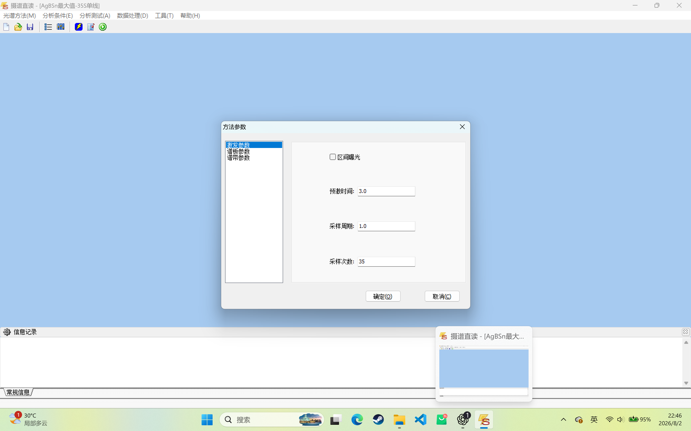

#### 图 7：分析条件 / 方法参数 / 谱带参数

- 文件：`20_分析条件_方法参数_谱带参数.png`
- 实测状态：实测界面
- 功能说明：展示方法基本信息、谱板布局、激发参数和谱带参数页签，确认方法条件分层配置。
- 源码依据：Main/mmMethod/FmMtdCfg、FmMtdLines、FmMtdLinesAdd、FmMtdPrint；Common/uAnaLine、uFitMode、uPeakMode

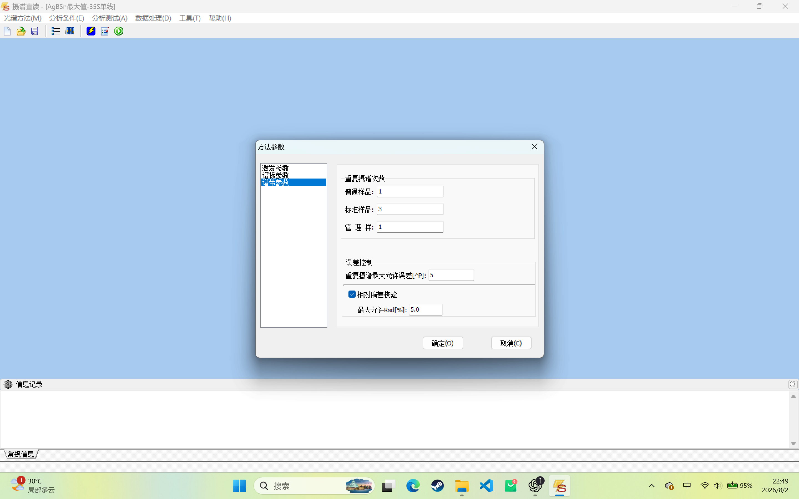

#### 图 8：分析条件 / 方法参数 / 谱板参数

- 文件：`20_分析条件_方法参数_谱板参数.png`
- 实测状态：实测界面
- 功能说明：展示方法基本信息、谱板布局、激发参数和谱带参数页签，确认方法条件分层配置。
- 源码依据：Main/mmMethod/FmMtdCfg、FmMtdLines、FmMtdLinesAdd、FmMtdPrint；Common/uAnaLine、uFitMode、uPeakMode

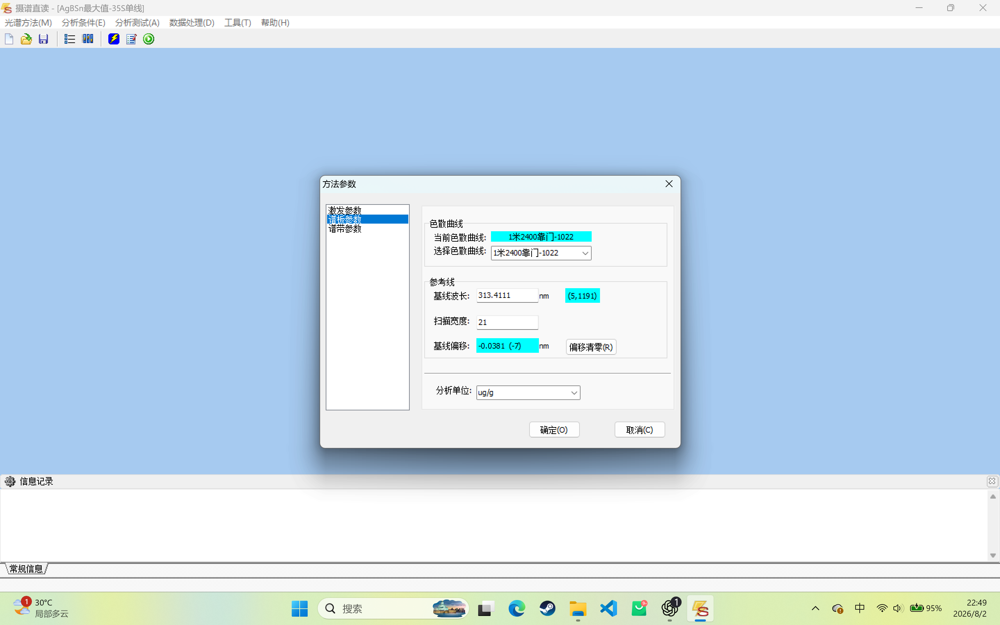

#### 图 9：分析条件 / 分析谱线 / 内标方式选项

- 文件：`21_分析条件_分析谱线_内标方式选项.png`
- 实测状态：实测选项展开界面
- 功能说明：展示谱线列表及其编辑参数；对应谱线类别、内标、峰值、拟合和分析条件配置。
- 源码依据：Main/mmMethod/FmMtdCfg、FmMtdLines、FmMtdLinesAdd、FmMtdPrint；Common/uAnaLine、uFitMode、uPeakMode

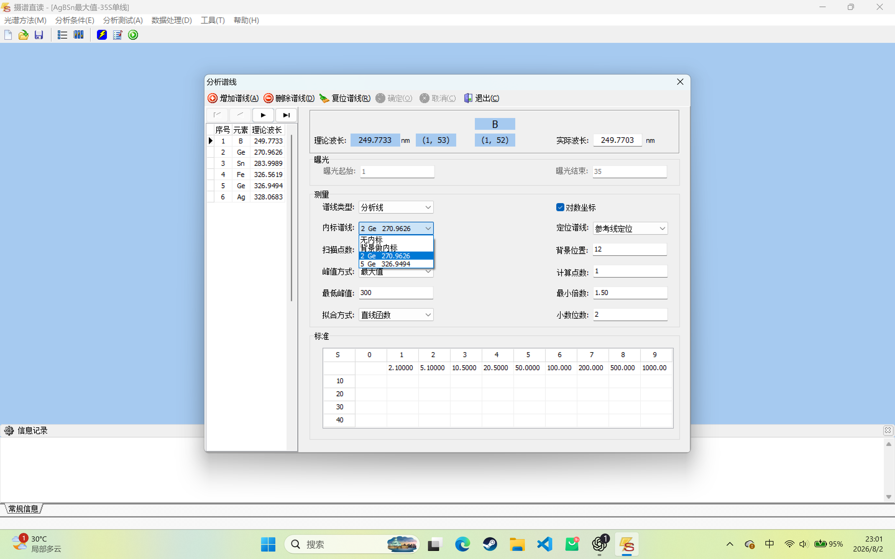

#### 图 10：分析条件 / 分析谱线 / 列表

- 文件：`21_分析条件_分析谱线_列表.png`
- 实测状态：实测界面
- 功能说明：展示谱线列表及其编辑参数；对应谱线类别、内标、峰值、拟合和分析条件配置。
- 源码依据：Main/mmMethod/FmMtdCfg、FmMtdLines、FmMtdLinesAdd、FmMtdPrint；Common/uAnaLine、uFitMode、uPeakMode

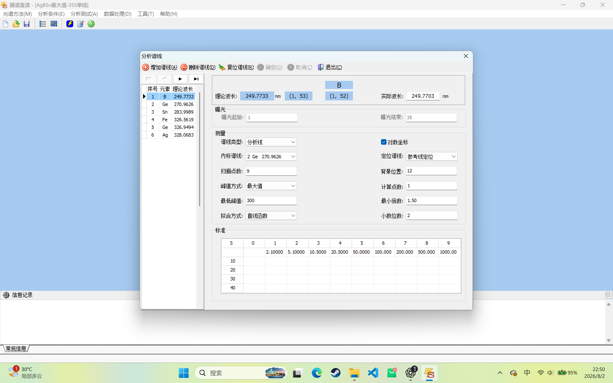

#### 图 11：分析条件 / 分析谱线 / 增加谱线

- 文件：`21_分析条件_分析谱线_增加谱线.png`
- 实测状态：实测界面
- 功能说明：展示谱线列表及其编辑参数；对应谱线类别、内标、峰值、拟合和分析条件配置。
- 源码依据：Main/mmMethod/FmMtdCfg、FmMtdLines、FmMtdLinesAdd、FmMtdPrint；Common/uAnaLine、uFitMode、uPeakMode

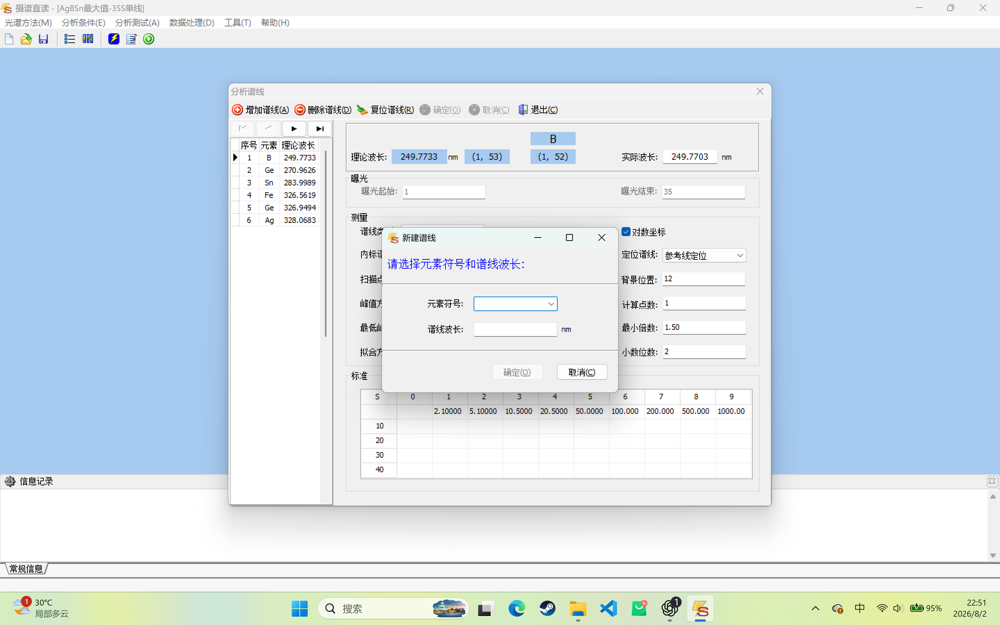

#### 图 12：分析条件 / 分析谱线 / 峰值方式选项

- 文件：`21_分析条件_分析谱线_峰值方式选项.png`
- 实测状态：实测选项展开界面
- 功能说明：展示谱线列表及其编辑参数；对应谱线类别、内标、峰值、拟合和分析条件配置。
- 源码依据：Main/mmMethod/FmMtdCfg、FmMtdLines、FmMtdLinesAdd、FmMtdPrint；Common/uAnaLine、uFitMode、uPeakMode

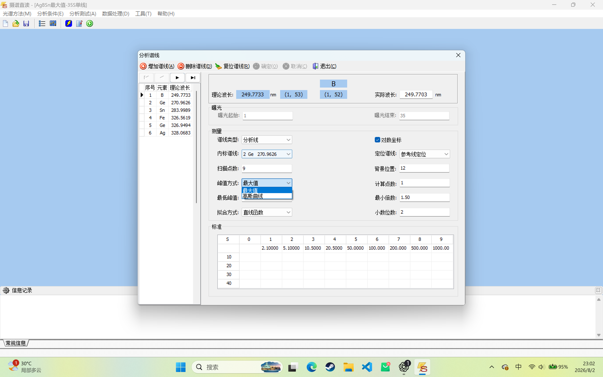

#### 图 13：分析条件 / 分析谱线 / 拟合方式选项

- 文件：`21_分析条件_分析谱线_拟合方式选项.png`
- 实测状态：实测选项展开界面
- 功能说明：展示谱线列表及其编辑参数；对应谱线类别、内标、峰值、拟合和分析条件配置。
- 源码依据：Main/mmMethod/FmMtdCfg、FmMtdLines、FmMtdLinesAdd、FmMtdPrint；Common/uAnaLine、uFitMode、uPeakMode

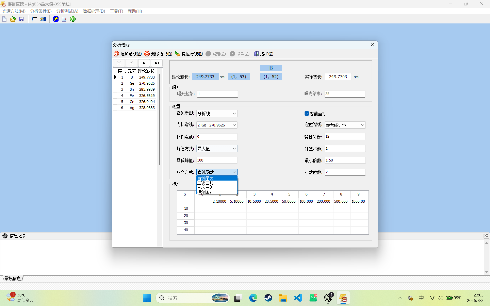

#### 图 14：分析条件 / 分析谱线 / 谱线类型选项

- 文件：`21_分析条件_分析谱线_谱线类型选项.png`
- 实测状态：实测选项展开界面
- 功能说明：展示谱线列表及其编辑参数；对应谱线类别、内标、峰值、拟合和分析条件配置。
- 源码依据：Main/mmMethod/FmMtdCfg、FmMtdLines、FmMtdLinesAdd、FmMtdPrint；Common/uAnaLine、uFitMode、uPeakMode

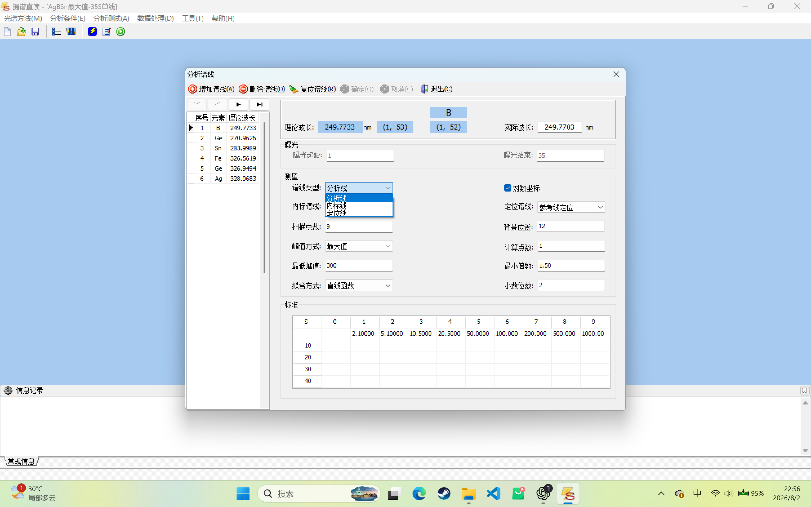

#### 图 15：分析条件 / 参数打印

- 文件：`22_分析条件_参数打印.png`
- 实测状态：实测界面
- 功能说明：展示方法条件参数和分析谱线参数打印入口，确认方法配置可形成打印输出。
- 源码依据：Main/mmMethod/FmMtdCfg、FmMtdLines、FmMtdLinesAdd、FmMtdPrint；Common/uAnaLine、uFitMode、uPeakMode

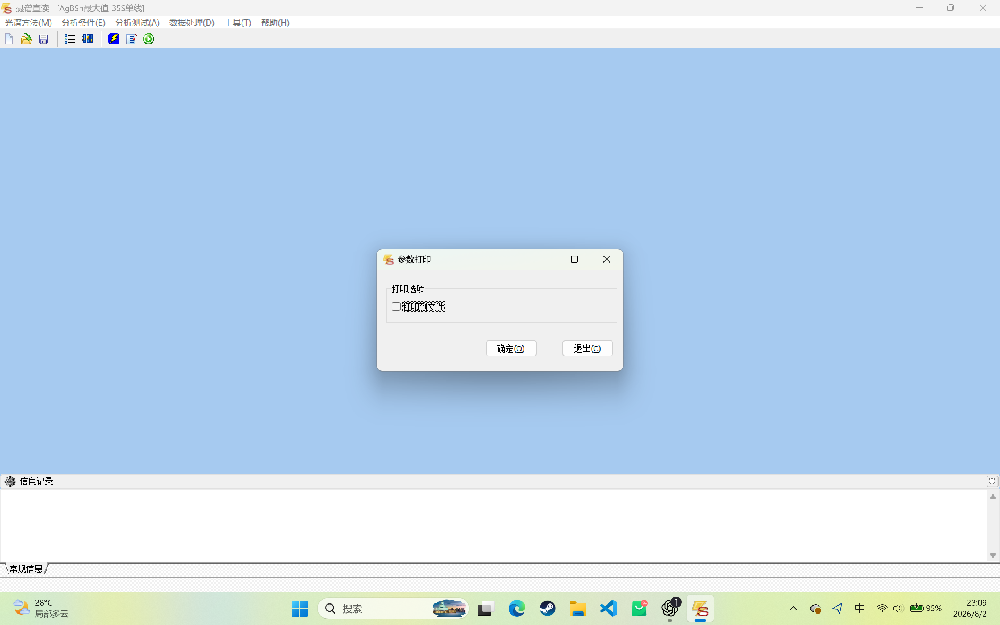

### 3. 分析测试

正式截图覆盖色散、蒸发和样品摄谱工作条件、采集控制台、预激发进度、预录样号、实际谱图、多样品对比、横纵向缩放、十字线/单点强度、全时样品谱图、样品结果、标准曲线、重复性数据检查和慢进参数入口；真实硬件采集状态及慢进人工干预闭环仍需现场验收。

源码依据：Main/mmAnalyze/FmIgnitCon、FmView、FmViewSingle、FmViewMulti、FmSampInput、FmAnaCurve、FmAnaPdt

#### 图 16：分析测试 / 样品摄谱 / 样品编号输入

- 文件：`30_分析测试_样品摄谱_样品编号输入.png`
- 实测状态：实测界面
- 功能说明：展示对应摄谱流程的入口界面，确认色散、蒸发或样品数据采集功能存在。
- 源码依据：Main/mmAnalyze/FmIgnitCon、FmView、FmViewSingle、FmViewMulti、FmSampInput、FmAnaCurve、FmAnaPdt

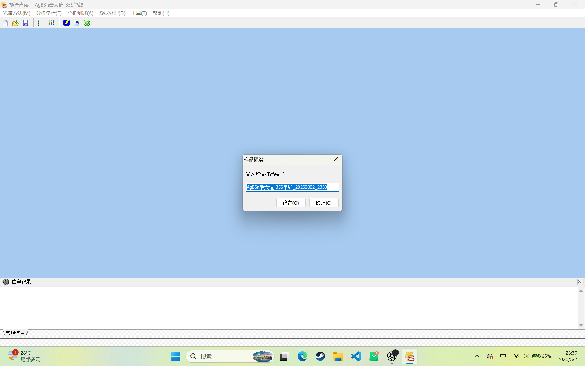

#### 图 17：分析测试 / 样品摄谱 / 采集控制台

- 文件：`30_分析测试_样品摄谱_采集控制台.png`
- 实测状态：实测界面
- 功能说明：展示全时样品摄谱工作台的样品输入、重复谱、试样摄谱、预热摄谱、停止和结束控制。
- 源码依据：Main/mmAnalyze/FmIgnitCon、FmView、FmViewSingle、FmViewMulti、FmSampInput、FmAnaCurve、FmAnaPdt

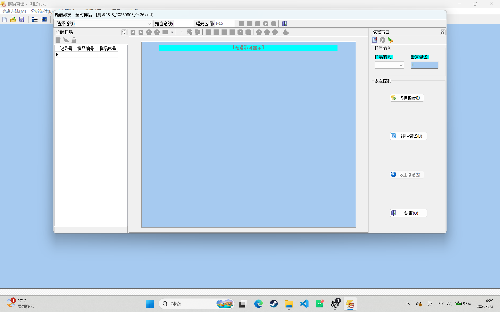

#### 图 18：分析测试 / 样品摄谱 / 预激发进度

- 文件：`30_分析测试_样品摄谱_预激发进度.png`
- 实测状态：实测采集进度/预激发状态
- 功能说明：展示样品摄谱实际启动后的第 1 次摄谱和预激发倒计时状态；不把设备未连接后的错误状态写成成功采集。
- 源码依据：Main/mmAnalyze/FmIgnitCon、FmView、FmViewSingle、FmViewMulti、FmSampInput、FmAnaCurve、FmAnaPdt

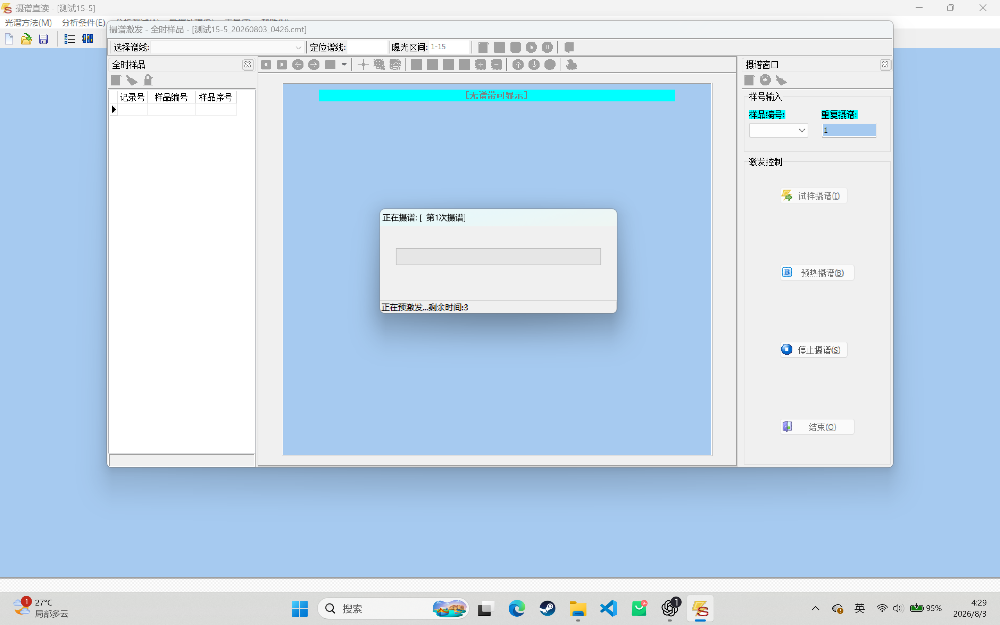

#### 图 19：分析测试 / 色散摄谱 / 工作条件

- 文件：`30_分析测试_色散摄谱_工作条件.png`
- 实测状态：实测界面
- 功能说明：展示对应摄谱流程的入口界面，确认色散、蒸发或样品数据采集功能存在。
- 源码依据：Main/mmAnalyze/FmIgnitCon、FmView、FmViewSingle、FmViewMulti、FmSampInput、FmAnaCurve、FmAnaPdt

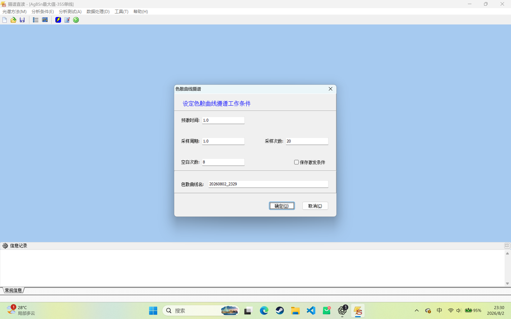

#### 图 20：分析测试 / 色散曲线分析 / 载入实际文件

- 文件：`30_分析测试_色散曲线分析_载入实际文件.png`
- 实测状态：实测载入实际数据文件
- 功能说明：展示曲线分析入口或载入实际数据后的分析界面，确认后续曲线处理流程。
- 源码依据：Main/mmAnalyze/FmIgnitCon、FmView、FmViewSingle、FmViewMulti、FmSampInput、FmAnaCurve、FmAnaPdt

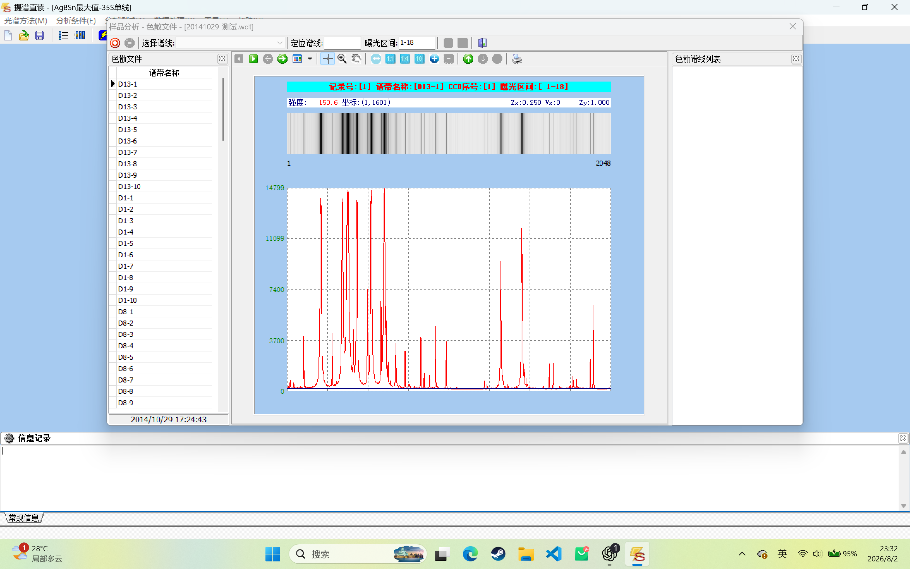

#### 图 21：分析测试 / 蒸发摄谱 / 工作条件

- 文件：`30_分析测试_蒸发摄谱_工作条件.png`
- 实测状态：实测界面
- 功能说明：展示对应摄谱流程的入口界面，确认色散、蒸发或样品数据采集功能存在。
- 源码依据：Main/mmAnalyze/FmIgnitCon、FmView、FmViewSingle、FmViewMulti、FmSampInput、FmAnaCurve、FmAnaPdt

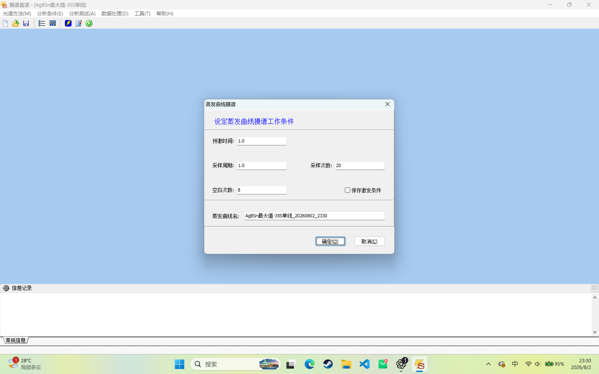

#### 图 22：分析测试 / 蒸发曲线分析 / 载入实际数据

- 文件：`30_分析测试_蒸发曲线分析_载入实际数据.png`
- 实测状态：实测界面
- 功能说明：展示曲线分析入口或载入实际数据后的分析界面，确认后续曲线处理流程。
- 源码依据：Main/mmAnalyze/FmIgnitCon、FmView、FmViewSingle、FmViewMulti、FmSampInput、FmAnaCurve、FmAnaPdt

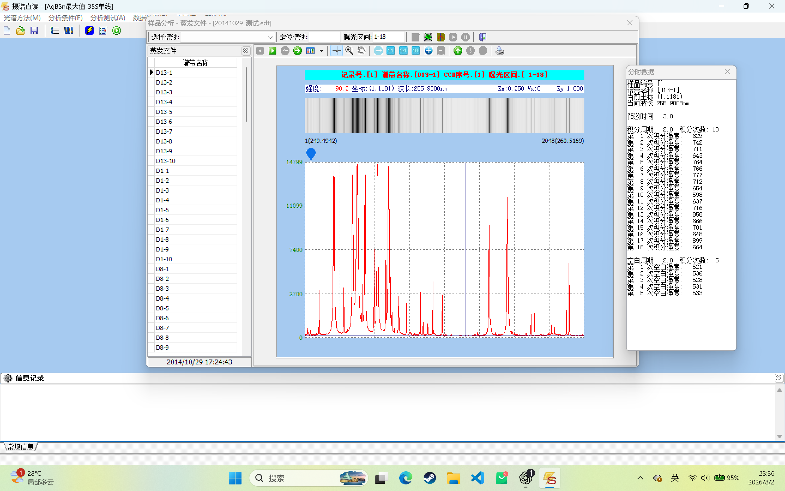

#### 图 23：分析测试 / 预录样号

- 文件：`30_分析测试_预录样号.png`
- 实测状态：实测界面
- 功能说明：展示样品号预录界面，确认样品队列可在摄谱前录入并管理。
- 源码依据：Main/mmAnalyze/FmIgnitCon、FmView、FmViewSingle、FmViewMulti、FmSampInput、FmAnaCurve、FmAnaPdt

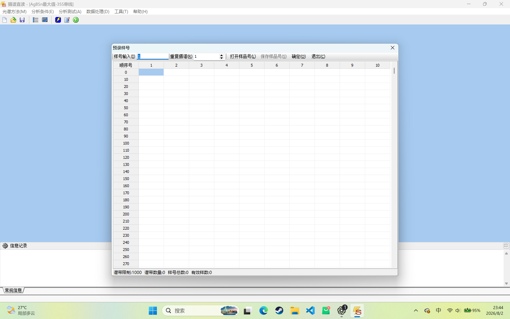

#### 图 24：补充 / 分析测试 / 慢进模式 / 观察测量谱带

- 文件：`30_补充_分析测试_慢进模式_观察测量谱带.png`
- 实测状态：实测界面
- 功能说明：展示分析参数中的测量谱带监控和等待时间设置；该图证明慢进配置入口，不单独证明完整人工干预闭环。
- 源码依据：Main/mmAnalyze/FmIgnitCon、FmView、FmViewSingle、FmViewMulti、FmSampInput、FmAnaCurve、FmAnaPdt

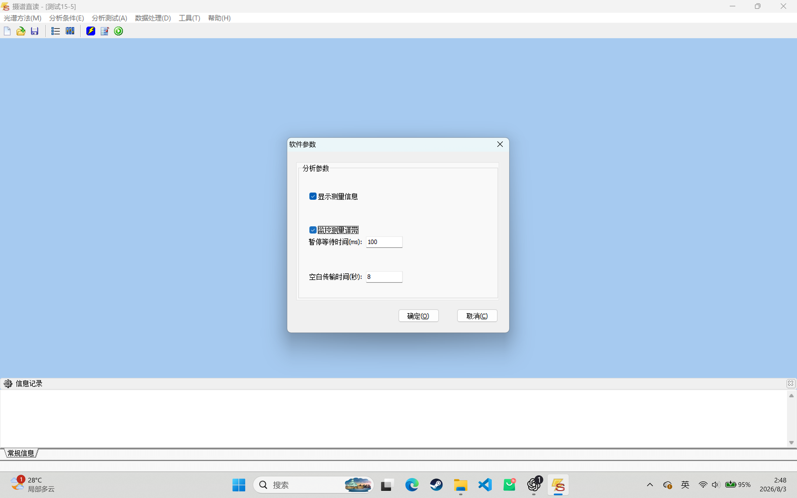

#### 图 25：补充 / 分析测试 / 查看谱图 / 全时样品实际谱图

- 文件：`30_补充_分析测试_查看谱图_全时样品实际谱图.png`
- 实测状态：实测实际谱图界面
- 功能说明：展示实际全时样品的谱图、记录列表、样品编号和曝光区间，确认全时样品谱图查看流程。
- 源码依据：Main/mmAnalyze/FmIgnitCon、FmView、FmViewSingle、FmViewMulti、FmSampInput、FmAnaCurve、FmAnaPdt

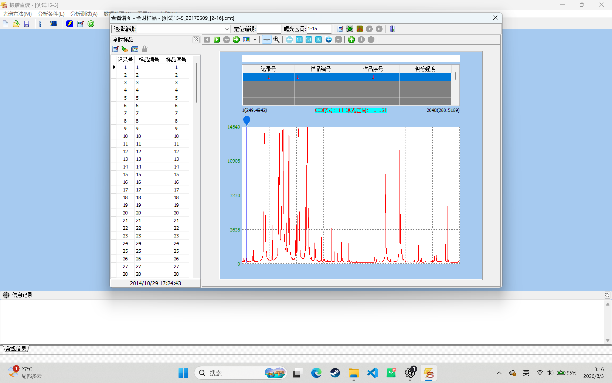

#### 图 26：补充 / 分析测试 / 查看谱图 / 十字线与单点强度 / 多样样品

- 文件：`30_补充_分析测试_查看谱图_十字线与单点强度_多样样品.png`
- 实测状态：实测界面
- 功能说明：展示十字线定位后的波长坐标、CCD 序号、曝光区间和各样品单点强度。
- 源码依据：Main/mmAnalyze/FmIgnitCon、FmView、FmViewSingle、FmViewMulti、FmSampInput、FmAnaCurve、FmAnaPdt

#### 图 27：补充 / 分析测试 / 查看谱图 / 多样品对比

- 文件：`30_补充_分析测试_查看谱图_多样品对比.png`
- 实测状态：实测界面
- 功能说明：展示多个样品同时绘制的强度曲线和样品记录列表，确认谱图对比功能。
- 源码依据：Main/mmAnalyze/FmIgnitCon、FmView、FmViewSingle、FmViewMulti、FmSampInput、FmAnaCurve、FmAnaPdt

#### 图 28：补充 / 分析测试 / 查看谱图 / 横向与纵向缩放

- 文件：`30_补充_分析测试_查看谱图_横向与纵向缩放.png`
- 实测状态：实测界面
- 功能说明：展示谱图缩放后的横向/纵向视图及缩放工具状态，确认谱图交互缩放功能。
- 源码依据：Main/mmAnalyze/FmIgnitCon、FmView、FmViewSingle、FmViewMulti、FmSampInput、FmAnaCurve、FmAnaPdt

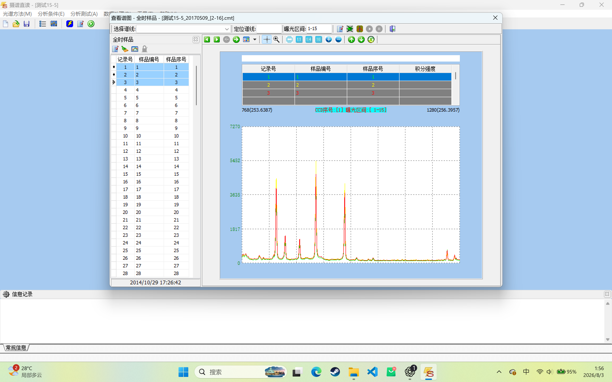

#### 图 29：补充 / 分析测试 / 标准曲线 / 三次曲线拟合

- 文件：`30_补充_分析测试_标准曲线_三次曲线拟合.png`
- 实测状态：实测界面
- 功能说明：展示标准曲线实际数据、拟合结果、标准点启停及拟合方式切换；用于核对曲线拟合和结果复核流程。
- 源码依据：Main/mmAnalyze/FmIgnitCon、FmView、FmViewSingle、FmViewMulti、FmSampInput、FmAnaCurve、FmAnaPdt

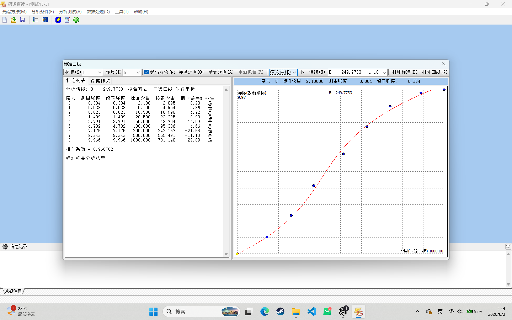

#### 图 30：补充 / 分析测试 / 标准曲线 / 拟合结果

- 文件：`30_补充_分析测试_标准曲线_拟合结果.png`
- 实测状态：实测界面
- 功能说明：展示标准曲线实际数据、拟合结果、标准点启停及拟合方式切换；用于核对曲线拟合和结果复核流程。
- 源码依据：Main/mmAnalyze/FmIgnitCon、FmView、FmViewSingle、FmViewMulti、FmSampInput、FmAnaCurve、FmAnaPdt

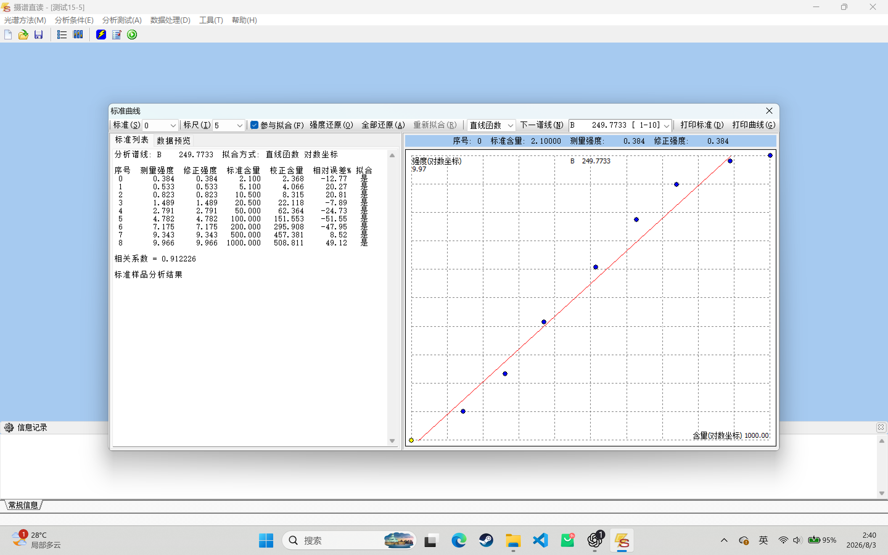

#### 图 31：补充 / 分析测试 / 标准曲线 / 标准点停用重算

- 文件：`30_补充_分析测试_标准曲线_标准点停用重算.png`
- 实测状态：实测界面
- 功能说明：展示标准曲线实际数据、拟合结果、标准点启停及拟合方式切换；用于核对曲线拟合和结果复核流程。
- 源码依据：Main/mmAnalyze/FmIgnitCon、FmView、FmViewSingle、FmViewMulti、FmSampInput、FmAnaCurve、FmAnaPdt

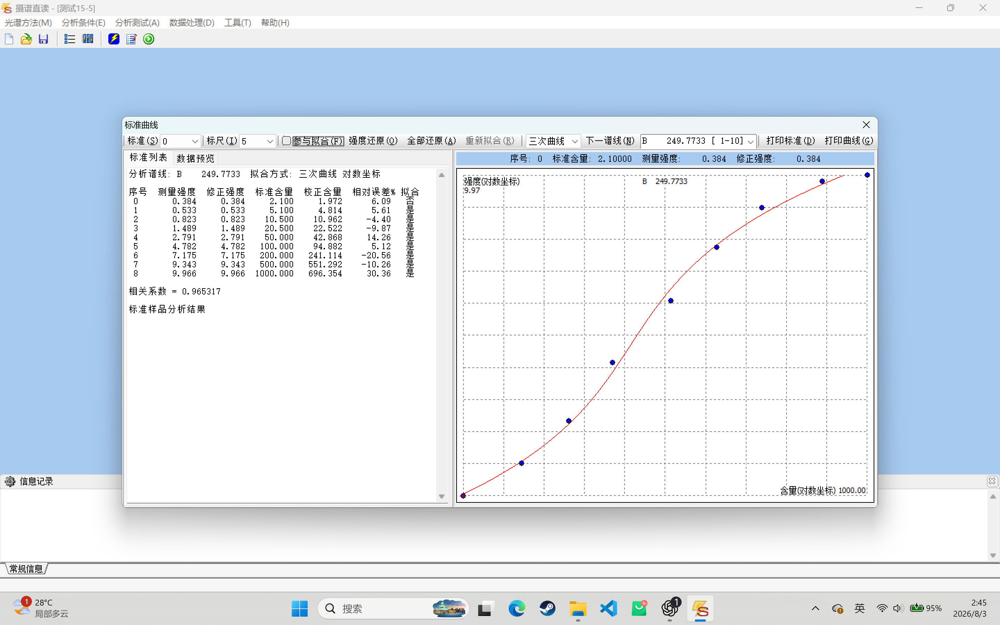

#### 图 32：补充 / 分析测试 / 样品分析 / 实际结果

- 文件：`30_补充_分析测试_样品分析_实际结果.png`
- 实测状态：实测界面
- 功能说明：展示样品分析载入实际全时样品后的谱图和结果分析界面。
- 源码依据：Main/mmAnalyze/FmIgnitCon、FmView、FmViewSingle、FmViewMulti、FmSampInput、FmAnaCurve、FmAnaPdt

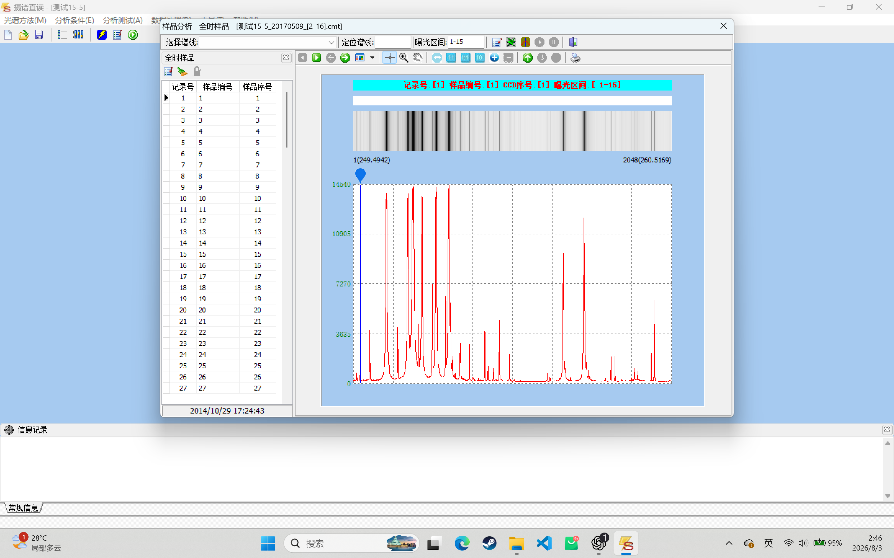

#### 图 33：补充 / 分析测试 / 重复性误差 / RSD数据检查

- 文件：`30_补充_分析测试_重复性误差_RSD数据检查.png`
- 实测状态：实测界面
- 功能说明：展示重复测量数据检查窗口，包含平均值、极差、标准偏差、相对偏差和有效点数等质控信息。
- 源码依据：Main/mmAnalyze/FmIgnitCon、FmView、FmViewSingle、FmViewMulti、FmSampInput、FmAnaCurve、FmAnaPdt

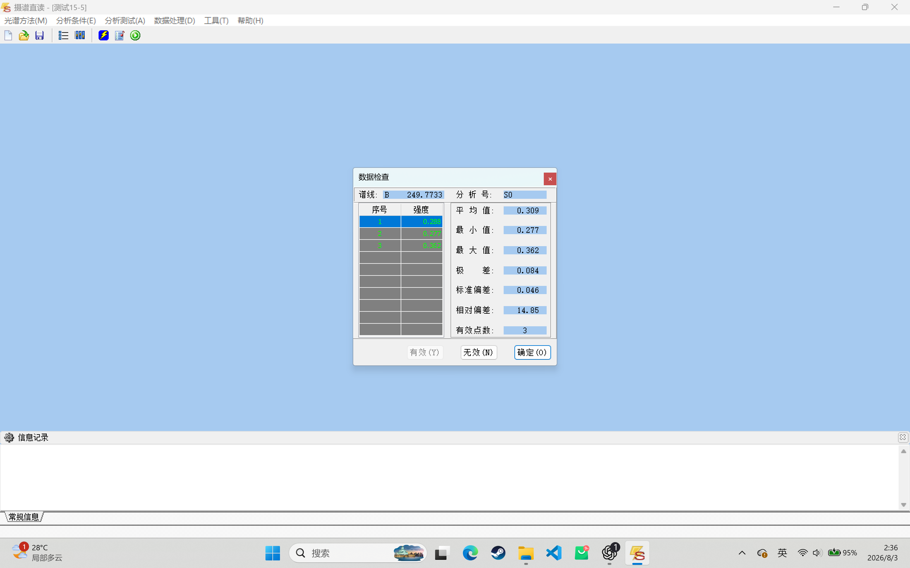

### 4. 数据处理

正式截图覆盖既有结果重新计算、报告打印、报告导出向导三步、强度导出三步向导及实际文件载入；PDF、独立打印预览和成功导出后的结果页仍未形成合格截图。

源码依据：Main/mmData/FmExport.pas、FmPrintDat.pas；Common/uExport.pas

#### 图 34：数据处理 / 导出强度 / 向导第三步

- 文件：`40_数据处理_导出强度_向导第三步.png`
- 实测状态：实测界面
- 功能说明：展示强度文件导出向导，覆盖文件选择、目标目录、同名文件处理、文本/电子表格类型和导出完成。
- 源码依据：Main/mmData/FmExport.pas、FmPrintDat.pas；Common/uExport.pas

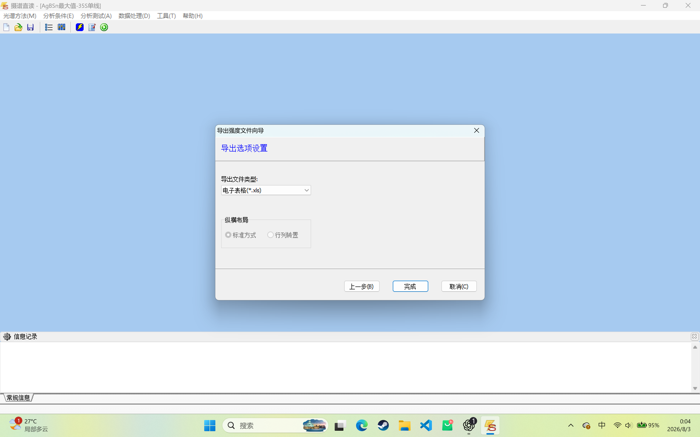

#### 图 35：数据处理 / 导出强度 / 向导第二步

- 文件：`40_数据处理_导出强度_向导第二步.png`
- 实测状态：实测界面
- 功能说明：展示强度文件导出向导，覆盖文件选择、目标目录、同名文件处理、文本/电子表格类型和导出完成。
- 源码依据：Main/mmData/FmExport.pas、FmPrintDat.pas；Common/uExport.pas

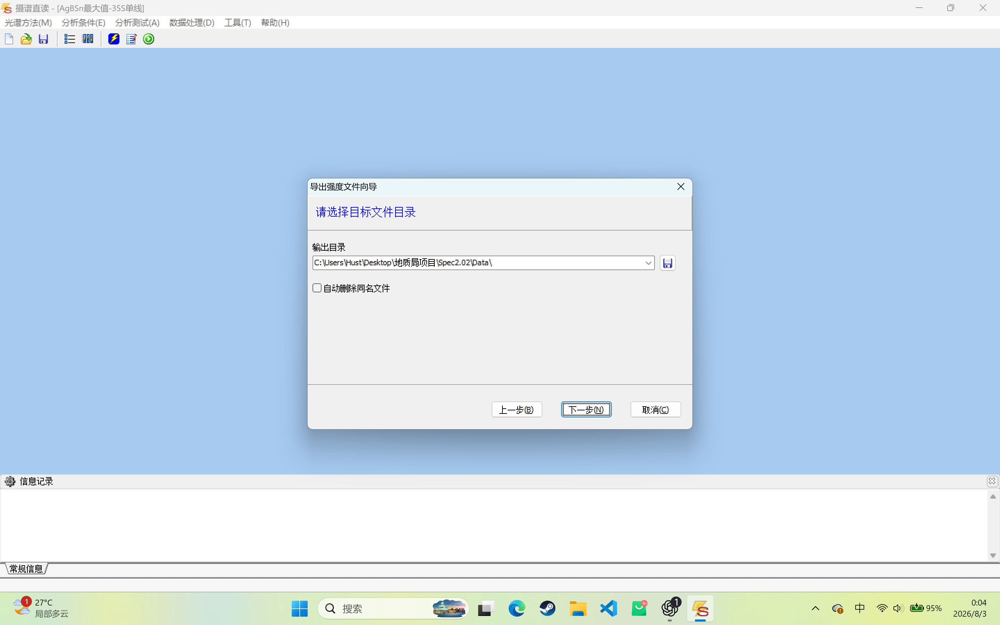

#### 图 36：数据处理 / 导出强度 / 导出类型选项

- 文件：`40_数据处理_导出强度_导出类型选项.png`
- 实测状态：实测选项展开界面
- 功能说明：展示强度文件导出向导，覆盖文件选择、目标目录、同名文件处理、文本/电子表格类型和导出完成。
- 源码依据：Main/mmData/FmExport.pas、FmPrintDat.pas；Common/uExport.pas

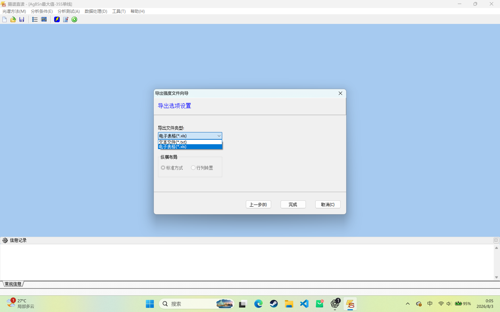

#### 图 37：数据处理 / 导出强度 / 载入文件后

- 文件：`40_数据处理_导出强度_载入文件后.png`
- 实测状态：实测载入实际数据文件后的界面
- 功能说明：展示强度文件导出向导，覆盖文件选择、目标目录、同名文件处理、文本/电子表格类型和导出完成。
- 源码依据：Main/mmData/FmExport.pas、FmPrintDat.pas；Common/uExport.pas

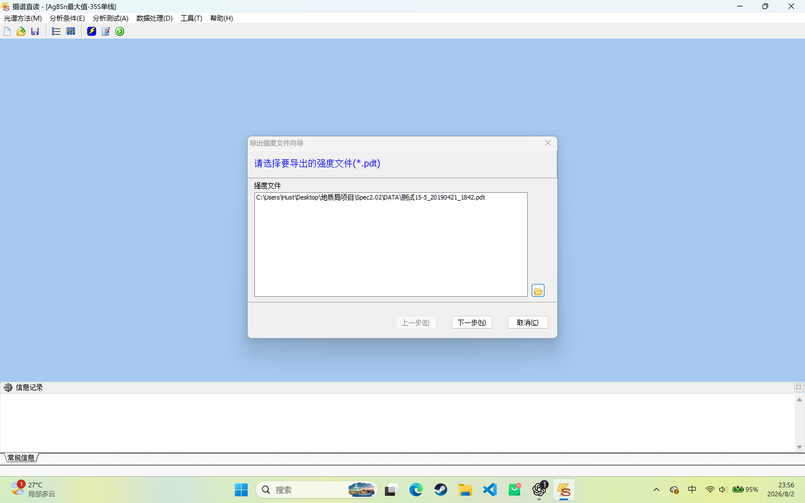

#### 图 38：数据处理 / 打印报告

- 文件：`40_数据处理_打印报告.png`
- 实测状态：实测界面
- 功能说明：展示报告打印入口，确认既有分析报告可选择并进入打印处理。
- 源码依据：Main/mmData/FmExport.pas、FmPrintDat.pas；Common/uExport.pas

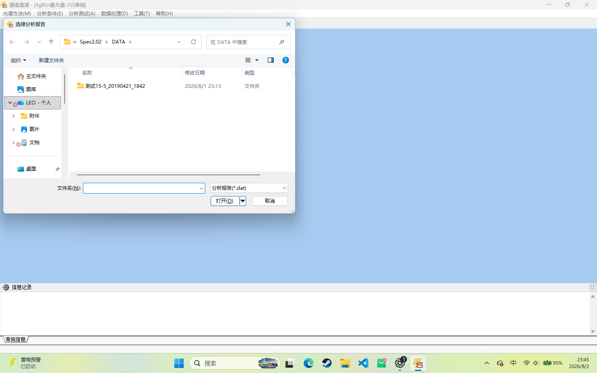

#### 图 39：补充 / 数据处理 / 导出报告 / 向导第一步 / 实际文件

- 文件：`40_补充_数据处理_导出报告_向导第一步_实际文件.png`
- 实测状态：实测载入实际文件后的界面
- 功能说明：展示报告导出向导入口，确认报告文件可按向导选择并输出为文本或电子表格。
- 源码依据：Main/mmData/FmExport.pas、FmPrintDat.pas；Common/uExport.pas

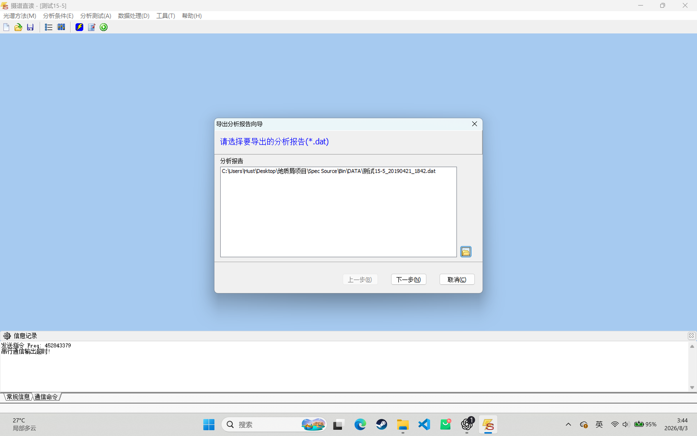

#### 图 40：补充 / 数据处理 / 导出报告 / 向导第三步 / 选项设置

- 文件：`40_补充_数据处理_导出报告_向导第三步_选项设置.png`
- 实测状态：实测向导导出选项界面
- 功能说明：展示报告导出向导入口，确认报告文件可按向导选择并输出为文本或电子表格。
- 源码依据：Main/mmData/FmExport.pas、FmPrintDat.pas；Common/uExport.pas

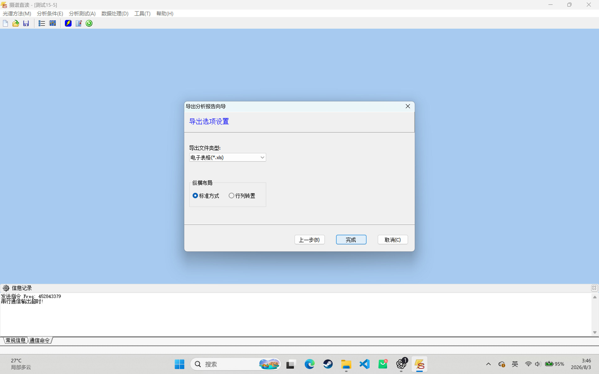

#### 图 41：补充 / 数据处理 / 导出报告 / 向导第二步 / 目标目录

- 文件：`40_补充_数据处理_导出报告_向导第二步_目标目录.png`
- 实测状态：实测向导目标目录设置界面
- 功能说明：展示报告导出向导入口，确认报告文件可按向导选择并输出为文本或电子表格。
- 源码依据：Main/mmData/FmExport.pas、FmPrintDat.pas；Common/uExport.pas

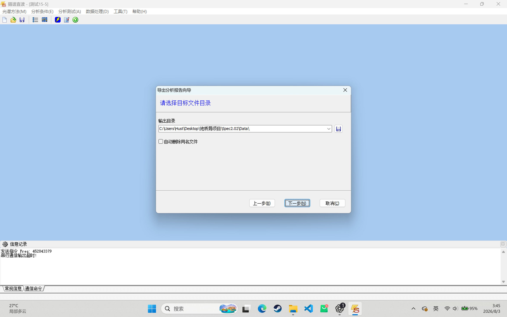

#### 图 42：补充 / 数据处理 / 重新计算 / 结果载入

- 文件：`40_补充_数据处理_重新计算_结果载入.png`
- 实测状态：实测载入结果参数界面
- 功能说明：展示既有强度结果重新计算入口，确认可结合当前方法重算分析结果。
- 源码依据：Main/mmData/FmExport.pas、FmPrintDat.pas；Common/uExport.pas

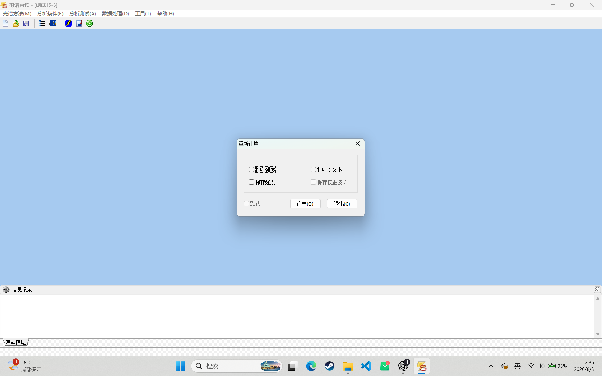

### 5. 工具

正式截图覆盖软件参数、设备参数、CCD 设置、方法管理、数据库备份压缩及蒸发摄谱文件导入；调试对中当前只能取得串口超时异常，未纳入正式功能证据。

源码依据：Main/mmTool/FmCfgSoftWare、FmOptHardWare、FmDebug、FmMtdManage、FmMtdBackup、FmImportPre

#### 图 43：工具 / 备份压缩数据库

- 文件：`50_工具_备份压缩数据库.png`
- 实测状态：实测界面
- 功能说明：展示方法库备份和数据库压缩操作入口；本次仅验证界面，不执行写库操作。
- 源码依据：Main/mmTool/FmCfgSoftWare、FmOptHardWare、FmDebug、FmMtdManage、FmMtdBackup、FmImportPre

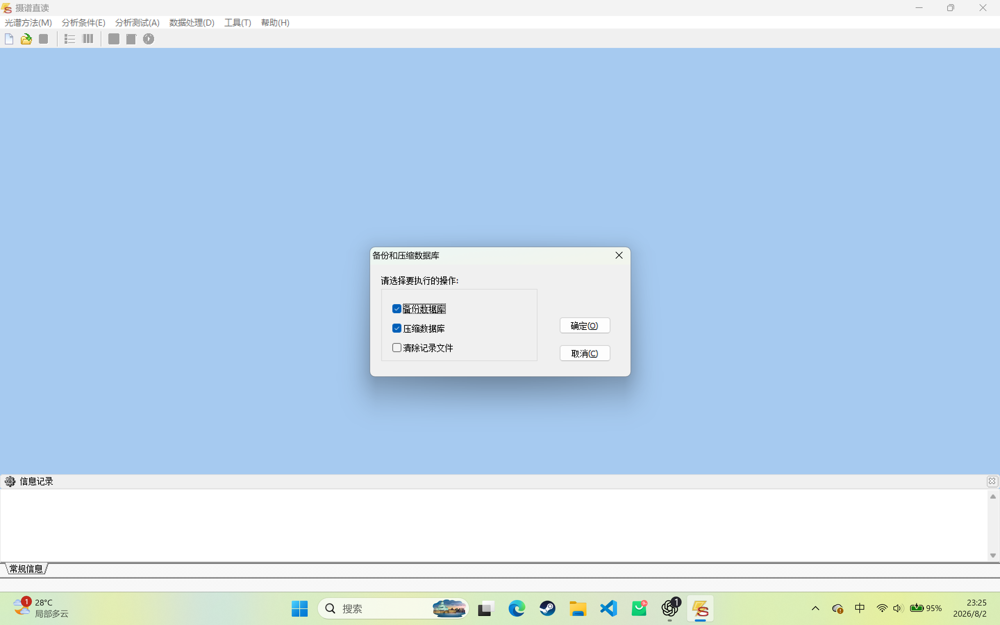

#### 图 44：工具 / 导入蒸发摄谱文件

- 文件：`50_工具_导入蒸发摄谱文件.png`
- 实测状态：实测界面
- 功能说明：展示蒸发摄谱文件导入入口、记录选择和目标样品数据设置。
- 源码依据：Main/mmTool/FmCfgSoftWare、FmOptHardWare、FmDebug、FmMtdManage、FmMtdBackup、FmImportPre

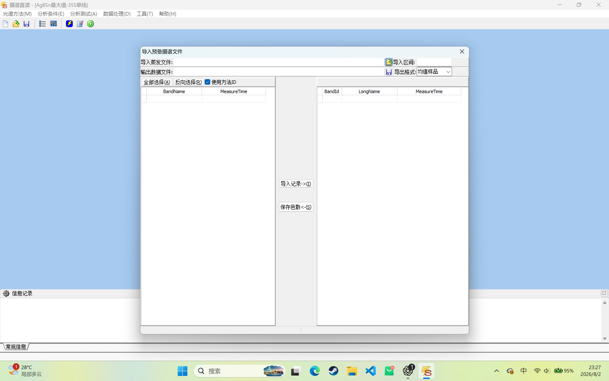

#### 图 45：工具 / 方法管理

- 文件：`50_工具_方法管理.png`
- 实测状态：实测界面
- 功能说明：展示方法库浏览、启用/禁用和当前方法管理功能。
- 源码依据：Main/mmTool/FmCfgSoftWare、FmOptHardWare、FmDebug、FmMtdManage、FmMtdBackup、FmImportPre

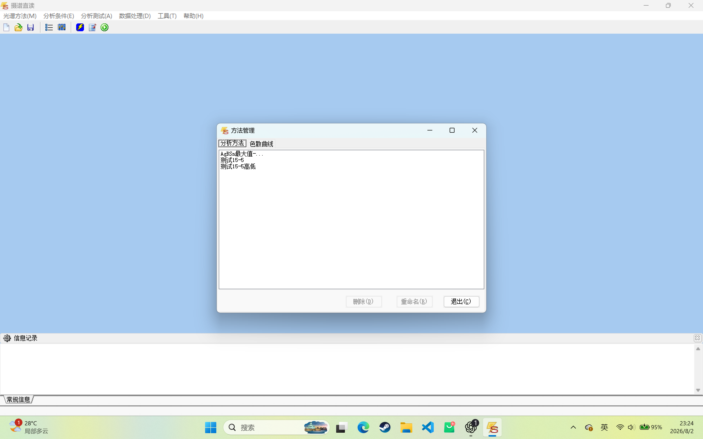

#### 图 46：工具 / 设备参数

- 文件：`50_工具_设备参数.png`
- 实测状态：实测界面
- 功能说明：展示串口、通信和设备参数；CCD 设置截图进一步确认采集硬件配置入口。
- 源码依据：Main/mmTool/FmCfgSoftWare、FmOptHardWare、FmDebug、FmMtdManage、FmMtdBackup、FmImportPre

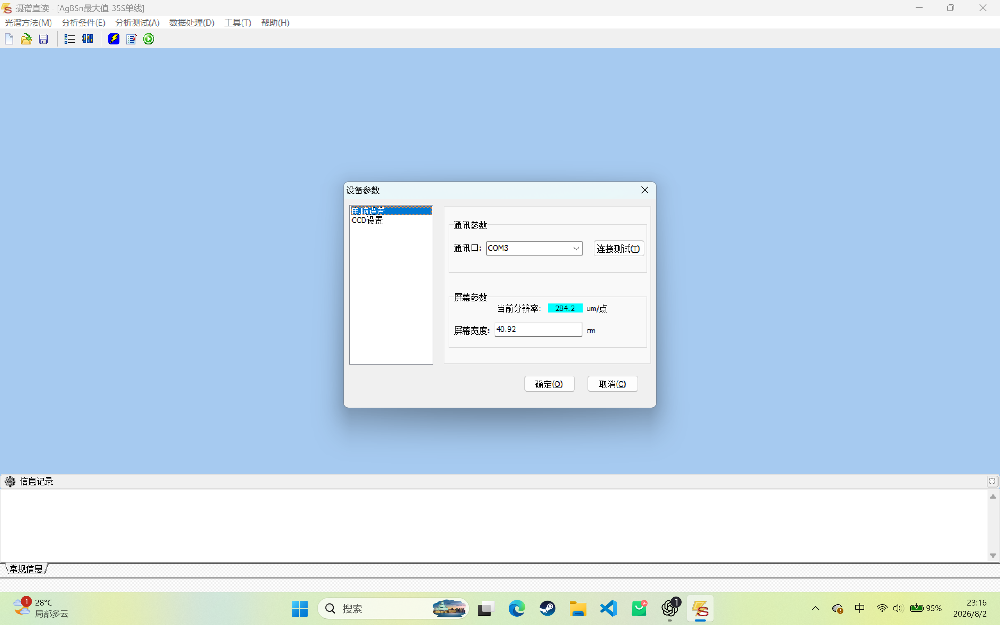

#### 图 47：工具 / 设备参数 / CCD设置

- 文件：`50_工具_设备参数_CCD设置.png`
- 实测状态：实测界面
- 功能说明：展示串口、通信和设备参数；CCD 设置截图进一步确认采集硬件配置入口。
- 源码依据：Main/mmTool/FmCfgSoftWare、FmOptHardWare、FmDebug、FmMtdManage、FmMtdBackup、FmImportPre

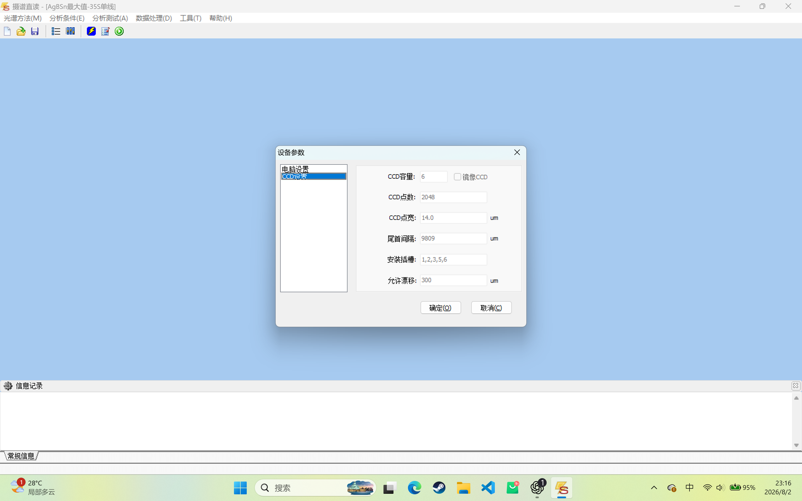

#### 图 48：工具 / 软件参数

- 文件：`50_工具_软件参数.png`
- 实测状态：实测界面
- 功能说明：展示软件级目录、日志、消息和显示相关配置。
- 源码依据：Main/mmTool/FmCfgSoftWare、FmOptHardWare、FmDebug、FmMtdManage、FmMtdBackup、FmImportPre

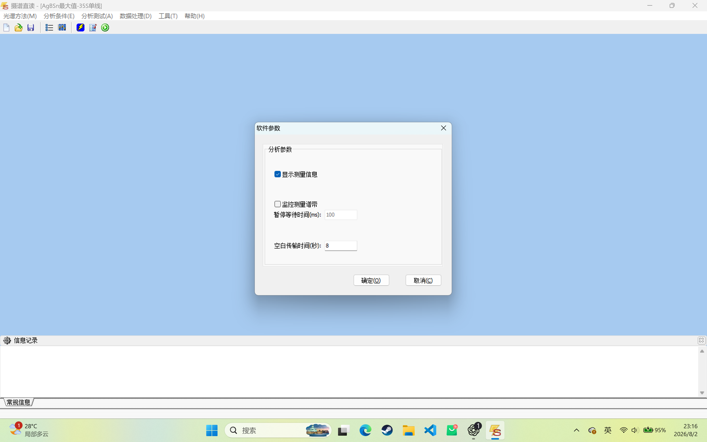

### 6. 帮助

正式截图覆盖关于窗口；帮助主题因同目录 DIRECT.CHM 缺失只能出现提示，未纳入正式证据。

源码依据：Main/Others/FmHint.pas、FmAbout.pas

#### 图 49：帮助 / 关于

- 文件：`60_帮助_关于.png`
- 实测状态：实测界面
- 功能说明：展示软件名称、版本和版权信息。
- 源码依据：Main/Others/FmHint.pas、FmAbout.pas

## 交付与复核说明

本报告与同目录中的 `01_功能树_源码整理版.md`、`02_截图清单_功能覆盖版.md` 配套使用。设备采集和串口部分只证明配置入口及可取得的采集状态，未把异常图作为功能证据；本次没有执行真实硬件采集或数据库写入。
