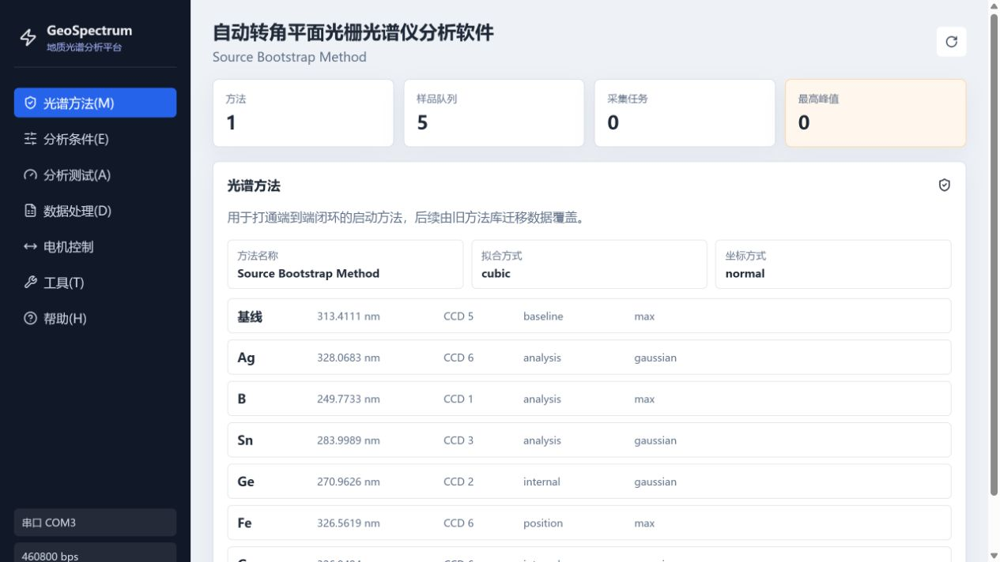

# SpecDirect 重构开发 Plan 任务说明

技术架构：FastAPI + React + SQLite + Tauri

## AI 任务要求

你是本项目的重构开发计划制定与后续执行 AI。请先完整阅读项目根目录的 `AGENTS.md`，再阅读其中列出的旧系统资料和功能说明。

当前阶段只生成重构开发 Plan，不要编写或修改代码。

### 重构目标

将旧版 SpecDirect 2.0.2 完整重构为采用以下架构的桌面应用：

- FastAPI：后端 API、业务服务、设备适配以及旧数据导入导出。
- React：前端界面和交互流程。
- SQLite：方法、样品、采集任务、谱图、分析结果及配置数据。
- Tauri：桌面应用壳、应用打包以及本机 FastAPI 或 sidecar 集成。

最终实现必须覆盖功能说明中的全部功能，不能只实现演示版本或核心流程。

### 事实依据

以 `Spec Source/`、`Spec2.02/`、`SpecFile/` 和 `Spec2.02功能研究/` 中的资料为依据，先建立完整功能清单，确保没有遗漏。使用 `SpecFile/` 时先阅读其 `README.md` 和 `文件来源清单.csv`；其中 77 个分类副本均须追溯到 `Spec Source/` 原路径。

所有功能、业务规则和数据格式结论都必须能够追溯到上述资料。`SpecFile/` 中可回溯到 `Spec Source/` 的副本只作为分类索引，不重复计为独立证据。`UI测试/` 及下方截图只用于参考视觉风格、布局密度和控件样式，不得作为功能、业务、接口、数据格式或架构依据，也不要修改 `UI测试/`。

### 开发方式

- 把全部功能拆分为尽可能小、可独立运行和验证的步骤。
- 每一步只开发一个功能或一个最小闭环，不要一次搭建大量模块。
- 优先采用纵向切片，同时打通该功能必要的数据库、后端、API 和前端。
- 明确领域规则、应用服务、SQLite 存储、旧格式适配、设备适配、FastAPI、React 和 Tauri 之间的边界，保持模块低耦合、可替换、可补充。
- 不要提前建设当前功能用不到的通用框架。

### 验证与确认

Plan 中的每一步都必须写明：

- 目标和范围。
- 不包含的内容。
- 涉及的模块和产物。
- 数据库、API、前端和 Tauri 变化。
- 测试方法和量化通过标准。
- 失败后的处理方式。

每一步开发完成后，由你自行执行自动化测试、构建检查和必要的运行验证，并提交结果、证据与结论。确认方只需确认结果，不执行手工测试或人工验收步骤。

未收到明确确认前，不得进入下一步。如存在无法自动验证的项目，必须说明原因、替代证据和剩余风险，不得把验证任务转交给确认方。

### Plan 输出内容

请依次给出：

1. 项目目标、约束和待确认事项。
2. 原始资料与事实来源。
3. 目标架构和模块边界。
4. 完整功能清单及追踪关系。
5. 分阶段开发路线。
6. 每一步的实施范围、测试方法和通过标准。
7. 数据迁移及旧格式兼容策略。
8. 设备模拟、真实设备接入和替代验证方案。
9. Tauri 桌面集成与发布策略。
10. 风险、依赖和待决策事项。
11. 第一个开发步骤的建议范围。

Plan 输出完成后立即停止，提交 Plan 并等待确认。不要开始编码。

## 前端 UI 视觉参考

下图只用于参考页面密度、侧边导航、配色和控件样式，不代表正式功能、业务流程或系统架构。

